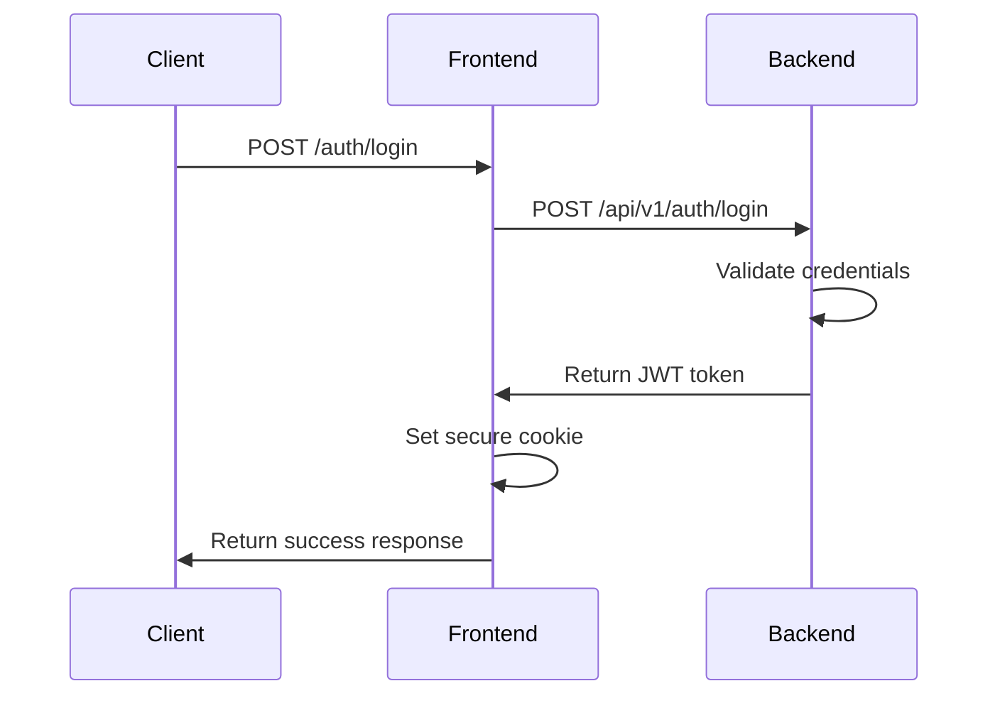
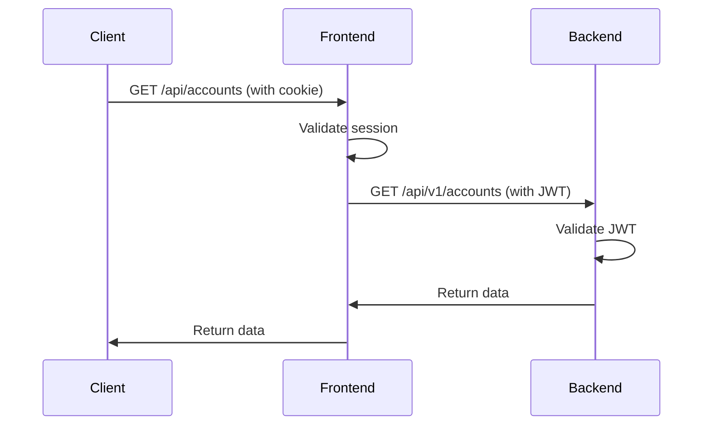

# CBS_PYTHON V2.0 - API Contract Specification

## Overview

This document defines the API contract between the frontend Express.js application and the backend Flask application for the CBS_PYTHON V2.0 Core Banking System.

## Base Configuration

### Frontend Server
- **Host**: `localhost` (development) / `banking.domain.com` (production)
- **Port**: `3000` (development) / `443` (production)
- **Protocol**: HTTP (development) / HTTPS (production)

### Backend Server
- **Host**: `127.0.0.1` (development) / `api.banking.domain.com` (production)
- **Port**: `5000` (development) / `443` (production)
- **Protocol**: HTTP (development) / HTTPS (production)

### API Routing Pattern
All frontend API calls are proxied through the Express server to the backend:
```
Frontend Request: GET /api/v1/accounts
Express Router: Proxies to Backend
Backend Endpoint: GET http://127.0.0.1:5000/api/v1/accounts
```

## Authentication Flow

### Login Process


### Request Authentication


## API Endpoints Specification

### Authentication Endpoints

#### POST /api/v1/auth/login
**Purpose**: Authenticate user and create session

**Request**:
```json
{
  "username": "string",
  "password": "string",
  "remember_me": "boolean (optional)"
}
```

**Response** (Success - 200):
```json
{
  "success": true,
  "token": "jwt_token_string",
  "user_id": "string",
  "expires_at": "ISO_timestamp",
  "user_info": {
    "username": "string",
    "role": "string",
    "permissions": ["string"]
  }
}
```

**Response** (Error - 401):
```json
{
  "error": "Invalid credentials",
  "code": "AUTH_FAILED",
  "timestamp": "ISO_timestamp"
}
```

#### POST /api/v1/auth/logout
**Purpose**: Logout user and invalidate session

**Request**: No body required (uses session/token)

**Response** (Success - 200):
```json
{
  "success": true,
  "message": "Logged out successfully"
}
```

#### POST /api/v1/auth/refresh
**Purpose**: Refresh authentication token

**Request**:
```json
{
  "refresh_token": "string"
}
```

**Response** (Success - 200):
```json
{
  "success": true,
  "token": "new_jwt_token",
  "expires_at": "ISO_timestamp"
}
```

### Account Management Endpoints

#### GET /api/v1/accounts
**Purpose**: Get user's accounts list

**Query Parameters**:
- `limit` (optional): Number of results (default: 50)
- `offset` (optional): Pagination offset (default: 0)
- `status` (optional): Filter by account status

**Response** (Success - 200):
```json
{
  "success": true,
  "accounts": [
    {
      "account_id": "string",
      "account_number": "encrypted_string",
      "account_type": "savings|checking|fixed_deposit",
      "balance": "number",
      "available_balance": "number",
      "currency": "string",
      "status": "active|inactive|closed",
      "created_at": "ISO_timestamp",
      "last_activity": "ISO_timestamp"
    }
  ],
  "total_count": "number",
  "limit": "number",
  "offset": "number"
}
```

#### GET /api/v1/accounts/{account_id}
**Purpose**: Get specific account details

**Response** (Success - 200):
```json
{
  "success": true,
  "account": {
    "account_id": "string",
    "account_number": "encrypted_string",
    "account_type": "string",
    "balance": "number",
    "available_balance": "number",
    "currency": "string",
    "status": "string",
    "interest_rate": "number",
    "created_at": "ISO_timestamp",
    "last_activity": "ISO_timestamp",
    "branch_code": "string",
    "branch_name": "string",
    "owner_info": {
      "customer_id": "string",
      "name": "string"
    }
  }
}
```

#### GET /api/v1/accounts/{account_id}/balance
**Purpose**: Get account balance information

**Response** (Success - 200):
```json
{
  "success": true,
  "balance_info": {
    "account_id": "string",
    "current_balance": "number",
    "available_balance": "number",
    "pending_transactions": "number",
    "currency": "string",
    "last_updated": "ISO_timestamp",
    "daily_limit": "number",
    "daily_spent": "number"
  },
  "encrypted_balance": "encrypted_string"
}
```

#### POST /api/v1/accounts
**Purpose**: Create new account

**Request**:
```json
{
  "account_type": "savings|checking|fixed_deposit",
  "initial_deposit": "number (optional)",
  "currency": "string (optional, default: USD)",
  "customer_id": "string (optional, uses current user)"
}
```

**Response** (Success - 201):
```json
{
  "success": true,
  "account": {
    "account_id": "string",
    "account_number": "encrypted_string",
    "account_type": "string",
    "balance": "number",
    "currency": "string",
    "status": "active",
    "created_at": "ISO_timestamp"
  },
  "message": "Account created successfully"
}
```

### Transaction Endpoints

#### GET /api/v1/transactions
**Purpose**: Get transaction list

**Query Parameters**:
- `account_id` (optional): Filter by account
- `limit` (optional): Number of results (default: 50)
- `offset` (optional): Pagination offset (default: 0)
- `start_date` (optional): Filter from date
- `end_date` (optional): Filter to date
- `type` (optional): Filter by transaction type

**Response** (Success - 200):
```json
{
  "success": true,
  "transactions": [
    {
      "transaction_id": "string",
      "account_id": "string",
      "type": "debit|credit|transfer",
      "amount": "number",
      "currency": "string",
      "description": "string",
      "merchant": "string (optional)",
      "status": "pending|completed|failed|cancelled",
      "created_at": "ISO_timestamp",
      "processed_at": "ISO_timestamp (optional)",
      "reference_number": "encrypted_string",
      "category": "string (optional)"
    }
  ],
  "total_count": "number",
  "limit": "number",
  "offset": "number"
}
```

#### GET /api/v1/transactions/{transaction_id}
**Purpose**: Get specific transaction details

**Response** (Success - 200):
```json
{
  "success": true,
  "transaction": {
    "transaction_id": "string",
    "account_id": "string",
    "type": "string",
    "amount": "number",
    "currency": "string",
    "description": "string",
    "merchant": "string",
    "status": "string",
    "created_at": "ISO_timestamp",
    "processed_at": "ISO_timestamp",
    "reference_number": "encrypted_string",
    "authorization_code": "encrypted_string",
    "fee": "number",
    "exchange_rate": "number",
    "category": "string",
    "tags": ["string"],
    "related_transactions": ["transaction_id"]
  }
}
```

#### POST /api/v1/transactions
**Purpose**: Create new transaction

**Request**:
```json
{
  "from_account": "string",
  "to_account": "string",
  "amount": "number",
  "currency": "string (optional, default: USD)",
  "description": "string",
  "transaction_type": "transfer|payment|deposit|withdrawal",
  "schedule_date": "ISO_timestamp (optional)",
  "reference": "string (optional)"
}
```

**Response** (Success - 201):
```json
{
  "success": true,
  "transaction": {
    "transaction_id": "string",
    "from_account": "encrypted_string",
    "to_account": "encrypted_string",
    "amount": "number",
    "currency": "string",
    "description": "string",
    "type": "string",
    "status": "pending",
    "created_at": "ISO_timestamp",
    "reference_number": "encrypted_string",
    "estimated_completion": "ISO_timestamp"
  },
  "message": "Transaction created successfully"
}
```

### Customer Management Endpoints

#### GET /api/v1/customers
**Purpose**: Get customers list (Admin only)

**Query Parameters**:
- `limit` (optional): Number of results (default: 50)
- `offset` (optional): Pagination offset (default: 0)
- `search` (optional): Search by name or email
- `status` (optional): Filter by customer status

**Response** (Success - 200):
```json
{
  "success": true,
  "customers": [
    {
      "customer_id": "string",
      "full_name": "string",
      "email": "encrypted_string",
      "phone": "encrypted_string",
      "status": "active|inactive|suspended",
      "kyc_status": "pending|verified|rejected",
      "created_at": "ISO_timestamp",
      "last_login": "ISO_timestamp",
      "account_count": "number",
      "total_balance": "number"
    }
  ],
  "total_count": "number",
  "limit": "number",
  "offset": "number"
}
```

#### GET /api/v1/customers/{customer_id}
**Purpose**: Get specific customer details

**Response** (Success - 200):
```json
{
  "success": true,
  "customer": {
    "customer_id": "string",
    "full_name": "string",
    "email": "encrypted_string",
    "phone": "encrypted_string",
    "date_of_birth": "encrypted_string",
    "address": {
      "street": "encrypted_string",
      "city": "string",
      "state": "string",
      "zip_code": "encrypted_string",
      "country": "string"
    },
    "status": "string",
    "kyc_status": "string",
    "created_at": "ISO_timestamp",
    "last_login": "ISO_timestamp",
    "account_count": "number",
    "total_balance": "number",
    "preferred_language": "string",
    "notification_preferences": {
      "email": "boolean",
      "sms": "boolean",
      "push": "boolean"
    }
  }
}
```

#### POST /api/v1/customers
**Purpose**: Create new customer (Admin only)

**Request**:
```json
{
  "full_name": "string",
  "email": "string",
  "phone": "string",
  "date_of_birth": "string (YYYY-MM-DD)",
  "address": {
    "street": "string",
    "city": "string",
    "state": "string",
    "zip_code": "string",
    "country": "string (optional, default: USA)"
  },
  "preferred_language": "string (optional, default: en)",
  "notification_preferences": {
    "email": "boolean (optional, default: true)",
    "sms": "boolean (optional, default: true)",
    "push": "boolean (optional, default: false)"
  }
}
```

**Response** (Success - 201):
```json
{
  "success": true,
  "customer": {
    "customer_id": "string",
    "full_name": "string",
    "email": "encrypted_string",
    "phone": "encrypted_string",
    "status": "active",
    "kyc_status": "pending",
    "created_at": "ISO_timestamp",
    "created_by": "string"
  },
  "message": "Customer created successfully"
}
```

## Error Response Standard

### Error Response Format
All API errors follow this standard format:

```json
{
  "error": "Human-readable error message",
  "code": "ERROR_CODE",
  "timestamp": "ISO_timestamp",
  "request_id": "string (optional)",
  "details": {
    "field": "Field-specific error message"
  }
}
```

### Common Error Codes
- **AUTH_REQUIRED** (401): Authentication required
- **AUTH_FAILED** (401): Authentication failed
- **ACCESS_DENIED** (403): Insufficient permissions
- **NOT_FOUND** (404): Resource not found
- **VALIDATION_ERROR** (400): Input validation failed
- **RATE_LIMITED** (429): Rate limit exceeded
- **SERVER_ERROR** (500): Internal server error

## Security Specifications

### Authentication Requirements
- All API endpoints require valid JWT token (except login)
- JWT tokens expire after 24 hours
- Refresh tokens available for token renewal
- Session management through secure HTTP-only cookies

### Data Encryption
- Sensitive data (account numbers, personal info) encrypted with AES-256
- Encryption keys managed securely
- PII data encrypted both in transit and at rest

### Request/Response Headers
**Required Request Headers**:
```
Authorization: Bearer {jwt_token}
Content-Type: application/json
X-API-Version: v1
```

**Security Response Headers**:
```
X-Content-Type-Options: nosniff
X-Frame-Options: DENY
X-XSS-Protection: 1; mode=block
Content-Security-Policy: default-src 'self'
```

## Rate Limiting

### Rate Limit Rules
- **Authentication endpoints**: 5 requests per minute per IP
- **Account endpoints**: 100 requests per minute per user
- **Transaction endpoints**: 50 requests per minute per user
- **Customer endpoints**: 20 requests per minute per user

### Rate Limit Headers
```
X-RateLimit-Limit: 100
X-RateLimit-Remaining: 95
X-RateLimit-Reset: 1642784400
```

## Pagination

### Pagination Parameters
- `limit`: Maximum number of results (default: 50, max: 200)
- `offset`: Number of results to skip (default: 0)

### Pagination Response
```json
{
  "success": true,
  "data": [...],
  "pagination": {
    "total_count": 500,
    "limit": 50,
    "offset": 0,
    "has_more": true,
    "next_offset": 50
  }
}
```

## WebSocket Specifications (Future Enhancement)

### Real-time Updates
For future implementation of real-time features:

**Connection**: `wss://banking.domain.com/ws`

**Message Format**:
```json
{
  "type": "transaction_update|balance_update|notification",
  "data": {...},
  "timestamp": "ISO_timestamp"
}
```

## Testing & Validation

### API Testing Requirements
- All endpoints must have unit tests
- Integration tests for complete workflows
- Load testing for performance validation
- Security testing for vulnerability assessment

### Mock Data
Development environment uses mock data for:
- User authentication (username/password: any/password)
- Account information
- Transaction history
- Customer data

## Versioning Strategy

### API Versioning
- Version specified in URL: `/api/v1/`
- Backward compatibility maintained for one major version
- Deprecation notices provided 6 months before removal
- Version headers supported: `X-API-Version: v1`

### Change Management
- Breaking changes require new major version
- Non-breaking changes can be added to existing version
- All changes documented in API changelog
- Client notification for upcoming changes

---

**API Contract Version**: 1.0  
**Last Updated**: January 2024  
**Next Review**: March 2024
