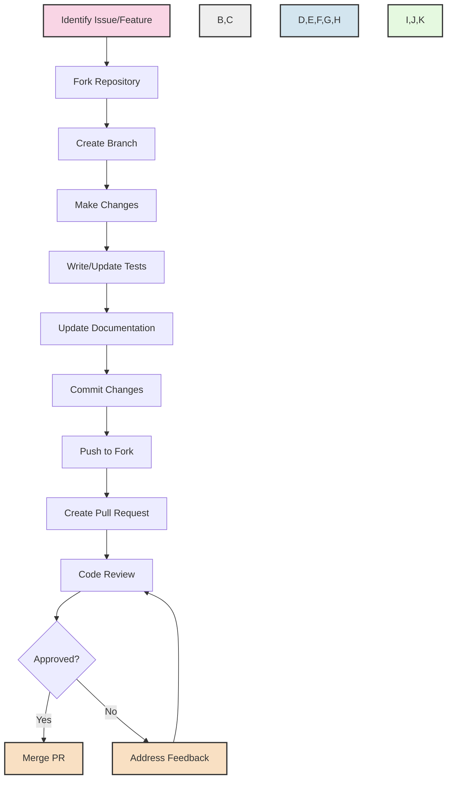

# 🤝 Contributing to CBS_PYTHON

<div align="center">

[](https://github.com/Soumya-r-Sahu/CBS_PYTHON/pulls)
[](https://github.com/Soumya-r-Sahu/CBS_PYTHON/issues)
[](https://github.com/Soumya-r-Sahu/CBS_PYTHON/blob/main/LICENSE)

</div>

Thank you for considering contributing to CBS_PYTHON! This document provides guidelines and instructions for contributing to make the process smooth for everyone.

## 📑 Table of Contents

- [Code of Conduct](#-code-of-conduct)
- [How Can I Contribute?](#-how-can-i-contribute)
- [Development Environment Setup](#-development-environment-setup)
- [Coding Guidelines](#-coding-guidelines)
- [Commit Message Guidelines](#-commit-message-guidelines)
- [Pull Request Process](#-pull-request-process)
- [Testing Guidelines](#-testing-guidelines)

## 📝 Code of Conduct

This project and everyone participating in it is governed by the CBS_PYTHON Code of Conduct. By participating, you are expected to uphold this code. Please report unacceptable behavior to [project-maintainers@example.com](mailto:project-maintainers@example.com).

## 🚀 How Can I Contribute?

There are many ways you can contribute to CBS_PYTHON:

<div align="center">

| Contribution Type | Description |
|-------------------|-------------|
| 🐛 **Bug Reports** | Submit detailed bug reports to help us improve |
| 💡 **Feature Requests** | Suggest new features or improvements |
| 📚 **Documentation** | Help improve documentation, examples, and guides |
| 💻 **Code Contributions** | Submit PRs to fix bugs or implement new features |
| 🧪 **Testing** | Help improve test coverage and quality |
| 📊 **Use Case Scenarios** | Share real-world use cases to guide development |

</div>

### Reporting Bugs

When reporting bugs, please include:

- A clear, descriptive title
- Steps to reproduce the issue
- Expected behavior vs. actual behavior
- Environment details (OS, Python version, etc.)
- Any relevant logs or error messages

Use the bug report template when creating an issue.

### Suggesting Features

When suggesting features:

- Clearly describe the feature and its benefits
- Explain how it aligns with the project's goals
- Provide examples of how it would be used
- Consider implementation complexity

Use the feature request template when creating an issue.

## 💻 Development Environment Setup

Follow these steps to set up your development environment:

```bash
# Fork the repository
# Clone your fork
git clone https://github.com/YOUR-USERNAME/CBS_PYTHON.git
cd CBS_PYTHON

# Set upstream remote
git remote add upstream https://github.com/Soumya-r-Sahu/CBS_PYTHON.git

# Create a virtual environment
python -m venv venv
source venv/bin/activate  # On Windows: venv\Scripts\activate

# Install dependencies
pip install -r requirements.txt
pip install -r additional_requirements.txt

# Install development dependencies
pip install -e ".[dev]"

# Initialize the development database
python init_system.py --dev
```

## 📋 Coding Guidelines

We follow these coding standards:

<div align="center">

| Aspect | Standard | Enforcement |
|--------|----------|-------------|
| **Style** | PEP 8 | flake8, black |
| **Type Checking** | PEP 484 | mypy |
| **Documentation** | Google Style Docstrings | pydocstyle |
| **Architecture** | Clean Architecture | code reviews |
| **Testing** | pytest | CI pipeline |

</div>

### Code Style

- Use [Black](https://github.com/psf/black) for code formatting
- Follow PEP 8 coding style
- Use type hints according to PEP 484
- Document all public methods and classes with docstrings

### Clean Architecture

- Adhere to Clean Architecture principles described in the [architecture documentation](documentation/clean_architecture/clean_architecture_overview.md)
- Keep layers separated with clear boundaries
- Follow dependency inversion principle

## 📝 Commit Message Guidelines

We follow the [Conventional Commits](https://www.conventionalcommits.org/) specification:

```
<type>(<scope>): <short summary>
```

Examples:

```
feat(accounts): add new account creation validation
fix(transactions): resolve issue with duplicate transaction IDs
docs(readme): update installation instructions
test(api): add tests for transfer endpoints
```

### Types

- **feat**: A new feature
- **fix**: A bug fix
- **docs**: Documentation only changes
- **style**: Changes that do not affect the meaning of the code
- **refactor**: A code change that neither fixes a bug nor adds a feature
- **perf**: A code change that improves performance
- **test**: Adding missing tests or correcting existing tests
- **chore**: Changes to the build process or auxiliary tools

## 🔄 Pull Request Process

1. **Branch Naming**: Use the format `<type>/<description>` (e.g., `feat/add-loan-calculator` or `fix/transaction-error`)
2. **Keep PRs Focused**: Each PR should address a single concern
3. **Write Descriptive PRs**: Use the PR template to provide necessary information
4. **Include Tests**: Add tests for new features and bug fixes
5. **Update Documentation**: Update any relevant documentation
6. **CI Pipeline**: Ensure all CI checks pass
7. **Code Review**: Incorporate feedback from code reviews
8. **Approval**: PRs require at least one approval from a maintainer

### PR Checklist

- [ ] I have read the CONTRIBUTING guidelines
- [ ] I have added tests that prove my fix/feature works
- [ ] I have updated the documentation accordingly
- [ ] I have added type hints to new code
- [ ] I have followed the style guidelines
- [ ] I have added a descriptive PR message

## 🧪 Testing Guidelines

We use `pytest` for testing. All new features and bug fixes should include tests:

```bash
# Run all tests
pytest

# Run tests with coverage
pytest --cov=core_banking

# Run specific tests
pytest tests/core_banking/accounts/
```

### Testing Patterns

```python
# Example test for a use case
def test_transfer_funds_use_case():
    # Arrange
    source_account = Account("ACC001", "CUST001", "SAVINGS", 1000)
    destination_account = Account("ACC002", "CUST002", "SAVINGS", 500)
    
    account_repository = MockAccountRepository()
    account_repository.save(source_account)
    account_repository.save(destination_account)
    
    transaction_repository = MockTransactionRepository()
    transaction_id_generator = MockIdGenerator("TRX001")
    
    use_case = TransferFundsUseCase(
        account_repository=account_repository,
        transaction_repository=transaction_repository,
        transaction_id_generator=transaction_id_generator
    )
    
    request = TransferRequest(
        source_account_id="ACC001",
        destination_account_id="ACC002",
        amount=200,
        reference="Test transfer"
    )
    
    # Act
    response = use_case.execute(request)
    
    # Assert
    assert response.transaction_id == "TRX001"
    assert response.status == "COMPLETED"
    
    updated_source = account_repository.get_by_id("ACC001")
    updated_destination = account_repository.get_by_id("ACC002")
    
    assert updated_source.balance == 800
    assert updated_destination.balance == 700
```

## 📊 Contribution Flow

<div align="center">



</div>

## 🔍 Review Process

Pull requests are reviewed based on these criteria:

- Adherence to coding standards
- Test coverage and quality
- Documentation quality
- Clean Architecture compliance
- Performance considerations
- Security practices

## 🌟 Recognition

All contributors will be recognized in our [CONTRIBUTORS.md](CONTRIBUTORS.md) file and project documentation.

---

<div align="center">
  
  **Thank you for contributing to CBS_PYTHON!**
  
  [](https://github.com/Soumya-r-Sahu/CBS_PYTHON/stargazers)
  
</div>