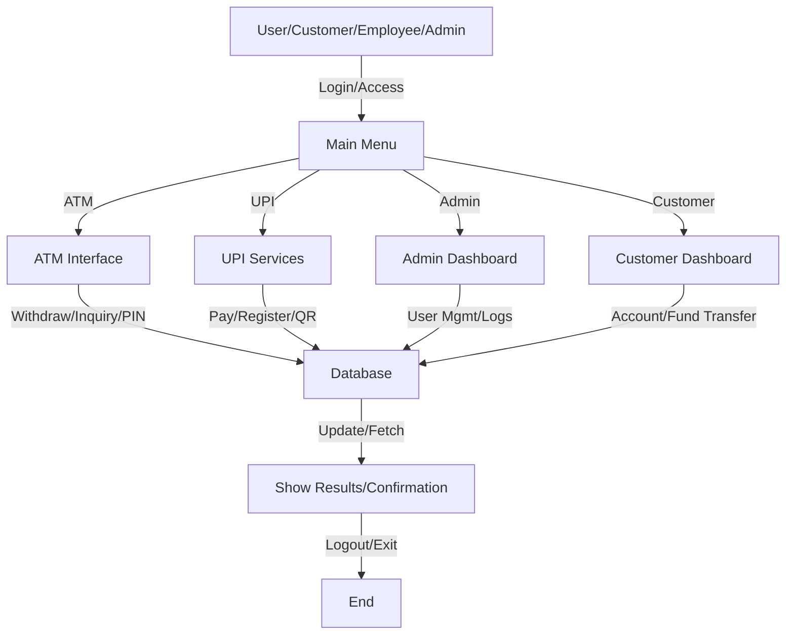

# 🏦 Core Banking System (CBS) - Python Implementation

**Version:** 1.0.0  
_Last updated: May 11, 2025_

---

## 🚀 Project Overview
This project implements a Core Banking System (CBS) using Python, following modern software development practices and architecture. The system provides essential banking functionalities including customer account management, transaction processing, ATM operations, UPI services, and administrative tools. The implementation is modular, secure, and follows banking industry standards.

## 🔐 Configuration
The CBS uses a centralized configuration system where all settings are managed through `config.py` at the project root. This ensures that credentials are securely managed from a single source. See [configuration documentation](./docs/configuration.md) for detailed setup instructions.

To get started:
1. Copy `.env.example` to `.env`
2. Update the values in `.env` with your local settings
3. Ensure your `.env` file is never committed to version control

---

## 📁 Directory Structure
```
/cbs-system/
├── app/                    # 🏦 Core application package
│   ├── __init__.py         # 📦 Package marker
│   ├── bin/                # 💻 CLI entry points, management scripts
│   ├── lib/                # 🧩 Shared Python modules, utilities
│   ├── config/             # ⚙️ Configuration files (YAML/JSON)
│   ├── logs/               # 📝 Application logs (info, error, audit, access)
│   └── models/             # 🗄️ Data models (SQLAlchemy, Pydantic)
├── admin_panel/            # 🛠️ Administrative interface
├── database/               # 🗄️ Database related files
│   ├── migrations/         # 🔄 Database migration scripts
│   ├── backups/            # 💾 Database backups
│   └── logs/               # 📝 Database logs
├── transactions/           # 💸 Transaction processing
│   ├── inbound/            # ⬇️ Incoming transaction files
│   └── outbound/           # ⬆️ Outgoing transaction files
├── integration/            # 🔗 External system integrations
│   ├── api_logs/           # 📑 API integration logs
│   └── partner_files/      # 🤝 Partner exchange files
├── security/               # 🔒 Security components
│   ├── certificates/       # 📜 SSL/TLS certificates
│   ├── logs/               # 📝 Security event logs
│   └── middleware/         # 🛡️ Security middlewares
├── monitoring/             # 📊 System monitoring
│   ├── alerts/             # 🚨 System alerts
│   └── reports/            # 📈 System reports
├── backups/                # 💾 System backups
├── scripts/                # 📝 Maintenance and deployment
├── tests/                  # 🧪 Test suites
│   ├── unit/               # 🧪 Unit tests
│   ├── integration/        # 🔗 Integration tests
│   └── e2e/                # 🔄 End-to-end tests
├── gui/                    # 🖥️ User interfaces (PyQt5/Tkinter)
├── upi/                    # 📱 UPI payment services
├── utils/                  # 🛠️ Utilities
├── requirements.txt        # 📦 Dependencies
├── pyproject.toml          # 📝 Project metadata
├── setup.py                # ⚙️ Package setup
└── main.py                 # 🚀 Application entry point
```

---

## 🌟 Features Table

| Feature                | Description                                                                 | Status      | Emoji      |
|------------------------|-----------------------------------------------------------------------------|-------------|------------|
| Account Management     | Create, update, manage customer accounts                                    | ✅ Complete | 👤💼       |
| Transaction Processing | Handle deposits, withdrawals, transfers                                     | ✅ Complete | 💸🔄       |
| ATM Interface          | Simulate ATM operations (withdrawal, inquiry, PIN change)                   | 🟡 CLI/GUI  | 🏧         |
| UPI Services           | Mobile payments, QR code, notifications                                     | 🟡 CLI/GUI  | 📱💳       |
| Admin Dashboard        | User management, logs, system settings                                      | ✅ Complete | 🛠️👨‍💼     |
| Security               | Encryption, authentication, authorization                                   | ✅ Complete | 🔒         |
| Audit Trail            | Logging and monitoring                                                      | ✅ Complete | 📋🕵️       |
| GUI                    | Customer dashboard, fund transfer, loan, support chat                       | 🟡 In Progress | 🖥️        |
| Testing                | Unit, integration, end-to-end tests                                         | ✅ Complete | 🧪         |

---

## 🛠️ How It Works (Flowchart)



---

## ⚡ Quick Setup Guide

1. **Clone the repository:**
   ```bash
   git clone https://github.com/your-username/CBS-python.git
   cd CBS-python
   ```
2. **Create and activate a virtual environment:**
   ```bash
   python -m venv venv
   # On Windows
   venv\Scripts\activate
   # On Unix or MacOS
   source venv/bin/activate
   ```
3. **Install dependencies:**
   ```bash
   pip install -r requirements.txt
   ```
4. **Initialize the database:**
   ```bash
   python main.py --init-db
   ```
5. **Run the system in your desired mode:**
   | Mode         | Command Example                        | Emoji  |
   |--------------|---------------------------------------|--------|
   | API Server   | python main.py --mode api --port 8000 | 🌐     |
   | GUI          | python main.py --mode gui             | 🖥️     |
   | Admin        | python main.py --mode admin           | 🛠️     |
   | CLI          | python main.py --mode cli             | 💻     |

---

## 🐞 Troubleshooting Guide

| Problem Type         | Solution/Tip                                              | Emoji  |
|----------------------|----------------------------------------------------------|--------|
| Missing Dependency   | Run `pip install -r requirements.txt`                    | ⚠️     |
| DB Connection Error  | Check DB config in `app/config/settings.yaml`            | ❌     |
| Import Error         | Ensure all modules are installed and paths are correct   | 📝     |
| Invalid Input        | Enter valid data, follow prompts                         | 🔄     |
| Unhandled Exception  | Check logs in `app/logs/` and `database/logs/`           | 🚨     |

**Example Error Message:**
```
WARNING: The following dependencies are missing:
  - cryptography
To install missing dependencies, run:
  pip install -r requirements.txt
Continuing with limited functionality in DEMO mode...
```

---

## 🔒 Security Considerations
- All passwords are hashed and encrypted
- Sensitive data is encrypted at rest
- Access control is enforced for all operations
- All actions are logged for audit purposes

---

## 🧩 Database Schema (Key Tables)
| Table         | Key Columns                                      | Emoji  |
|---------------|--------------------------------------------------|--------|
| Users         | user_id, name, email, account_number, balance    | 👤     |
| Transactions  | transaction_id, user_id, type, amount, timestamp | 💸     |
| Admins        | admin_id, username, password_hash, role          | 🛠️     |
| UPI           | upi_id, user_id, linked_account, status          | 📱     |
| ATM_Cards     | card_id, user_id, card_number, pin_hash, status  | 💳     |

---

## 🏆 Summary
- Modular, secure, and extensible core banking system
- CLI and GUI support (GUI in progress)
- Robust error handling and demo fallback
- Easy to run, test, and extend

---

## 🔮 Future Updates
- Full PyQt5 GUIs for all modules (ATM, UPI, Customer, Employee, Netbanking)
- AI-based fraud detection
- Multi-language support
- Real-time third-party API integration
- Enhanced error handling and logging
- Mobile app interface

---

## 📜 License
This project is licensed under the MIT License - see the LICENSE file for details.