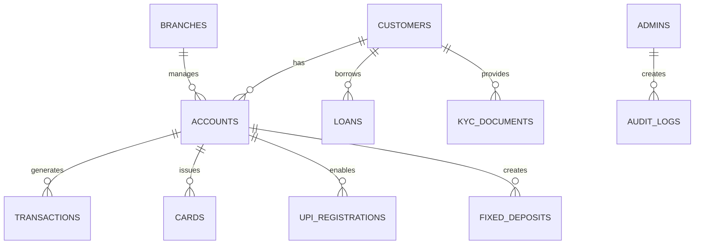

# 🏦 CBS_PYTHON: Core Banking System

[](https://github.com/Soumya-r-Sahu/CBS_PYTHON)
[](https://github.com/Soumya-r-Sahu/CBS_PYTHON)

[](CHANGELOG.md)

---

_Last updated: May 23, 2025_

---

## 📋 Quick Navigation
- [Overview](#overview)
- [Quick Start](#quick-start)
- [File Guide](#file-guide)
- [Configuration](#configuration)
- [Admin Portal](#admin-portal)
- [Banking UI](#banking-ui)
- [Module Progress](#module-progress)
- [Frontend Integration](#frontend-integration)
- [Database Reference](#database-reference)
- [Changelog](CHANGELOG.md)
- [Release Summary](release_summary.md)
- [Contributing](#contributing)

## 📝 Overview

CBS_PYTHON is a modular, domain-driven Core Banking System designed for extensibility, security, and modern banking needs.
- 🏗️ **Clean Architecture** (Domain, Application, Infrastructure, Presentation)
- 🧩 **Modular Domains** (Accounts, Customers, Loans, Transactions, UPI, etc.)
- 🖥️ **Multi-Interface**: API, CLI, GUI, Admin Dashboard, ATM/UPI
- 🔒 **Security**: Encryption, access control, audit trails
- 📊 **Analytics & BI**: Real-time dashboards, fraud detection
- 📚 **Comprehensive Documentation**

## ⚡ Quick Start

### Set Up Your Environment

Make sure you have Python 3.8+ installed, then set up the environment:

```bash
# Clone the repo
git clone https://github.com/Soumya-r-Sahu/CBS_PYTHON.git
cd CBS_PYTHON

# Create and activate a virtual environment
python -m venv venv
.\venv\Scripts\activate  # Windows
# or
source venv/bin/activate  # Linux/macOS

# Install dependencies
pip install -r requirements.txt
```

### Start the Banking System

The easiest way to start the system is to use the friendly startup script:

```powershell
# Start the entire banking system
python start_banking_server.py

# If you only need the API server
python start_banking_server.py --api-only
```

### Update the Database (if needed)

If you need to update your database to match code changes:

```powershell
# Update the development database safely
python Backend\scripts\deployment\database\update_banking_database.py
```

## 📂 File Guide

This section explains the user-friendly filenames in the Banking System and maps them to their technical counterparts.

### Core System Files

- **banking_system_server.py** - The main entry point for the entire banking system.
- **start_banking_server.py** - A simple script to launch the banking system with configuration options.
- **config.py** - Central configuration file for the entire banking system.

### API and Controllers

- **banking_api_endpoints.py** - Defines all available banking API services and their URL structures.
- **customer_accounts_controller.py** - Handles customer account information and balances.
- **money_transfer_controller.py** - Manages money transfers, payments, and transaction history.

### Database Management

- **banking_database_manager.py** - Internal tool for managing database structure and maintenance.
- **update_banking_database.py** - User-friendly tool for safely updating the database schema.

### Original File Mappings

For reference, here are the original technical filenames and their friendly replacements:

| Original Filename | User-Friendly Name |
|-------------------|-------------------|
| backend.py | banking_system_server.py |
| run_backend.py | start_banking_server.py |
| routes.py | banking_api_endpoints.py |
| account_controller.py | customer_accounts_controller.py |
| transaction_controller.py | money_transfer_controller.py |
| manage_database.py | banking_database_manager.py |
| run_migrations.py | update_banking_database.py |

## ⚙️ Configuration

Before running the system, configure your environment:
- ⚙️ **Database**: Edit `config.py` or `app/config/settings.yaml` for DB settings
- 🔑 **Secrets**: Set up environment variables or `.env` for sensitive data
- 🛡️ **Security**: Review `security/` for encryption and access control settings
- 📝 **Modules**: Ensure all modules have `__init__.py` and correct import paths

## 🗺️ Module Progress

| Module             | Status        | Progress |
|--------------------|--------------|----------|
| Accounts           | ✅ Complete   | 🟩🟩🟩🟩🟩🟩🟩🟩🟩🟩 100% |
| Customers          | ✅ Complete   | 🟩🟩🟩🟩🟩🟩🟩🟩🟩🟩 100% |
| Loans              | ✅ Complete   | 🟩🟩🟩🟩🟩🟩🟩🟩🟩🟩 100% |
| Transactions       | ✅ Complete   | 🟩🟩🟩🟩🟩🟩🟩🟩🟩🟩 100% |
| ATM                | ✅ Complete   | 🟩🟩🟩🟩🟩🟩🟩🟩🟩🟩 100% |
| Admin              | ✅ Complete   | 🟩🟩🟩🟩🟩🟩🟩🟩🟩🟩 100% |
| Internet Banking   | 🟠 In Progress| 🟩🟩🟩🟩🟩🟩🟨🟨⬜️⬜️ 60% |
| Mobile Banking     | 🟠 In Progress| 🟩🟩🟩🟩🟧🟧⬜️⬜️⬜️⬜️ 40% |
| UPI                | ✅ Complete   | 🟩🟩🟩🟩🟩🟩🟩🟩🟩🟩 100% |
| NEFT               | ✅ Complete   | 🟩🟩🟩🟩🟩🟩🟩🟩🟩🟩 100% |
| RTGS               | ✅ Complete   | 🟩🟩🟩🟩🟩🟩🟩🟩🟩🟩 100% |
| Fraud Detection    | 🟠 In Progress| 🟩🟩🟩🟧🟧🟥🟥⬜️⬜️⬜️ 30% |
| Audit Trail        | ✅ Complete   | 🟩🟩🟩🟩🟩🟩🟩🟩🟩🟩 100% |
| Risk & Compliance  | ✅ Complete   | 🟩🟩🟩🟩🟩🟩🟩🟩🟩🟩 100% |
| Treasury           | ✅ Complete   | 🟩🟩🟩🟩🟩🟩🟩🟩🟩🟩 100% |
| BI Dashboards      | 🟠 In Progress| 🟩🟩🟥🟥⬜️⬜️⬜️⬜️⬜️⬜️ 20% |

## 🖥️ Frontend Integration

The banking system is designed to work with Django, a powerful Python web framework.

### Connecting a Django Frontend

```python
# In your Django views.py
from integration_interfaces.django_client import BankingAPIClient

def account_view(request):
    client = BankingAPIClient()
    client.set_session_from_request(request)
    accounts = client.get_accounts()
    return render(request, 'accounts/list.html', {'accounts': accounts})
```

## 📊 Database Reference

### Key Tables
| Table Name            | Key Columns                                               | Emoji |
|-----------------------|-----------------------------------------------------------|-------|
| customers             | customer_id, name, dob, email, phone, address             | 👤👪 |
| accounts              | account_number, customer_id, balance, type, status        | 💳💰 |
| transactions          | transaction_id, account_number, type, amount, timestamp   | 💸🔄 |
| cards                 | card_id, account_id, card_number, expiry_date, cvv, pin   | 🃏💳 |
| upi_registrations     | upi_id, account_number, linked_device, status, created_at | 📱💲 |

## 🤝 Contributing

Please refer to the Documentation directory for detailed contribution guidelines. We welcome contributions to improve this core banking system.

### Contribution Areas

- Bug fixes and issue reports
- Feature enhancements
- Documentation improvements
- Test coverage expansion
- UI/UX enhancements

### Code of Conduct

We expect all contributors to adhere to our code of conduct, which promotes a respectful and inclusive environment for collaboration.
| admins                | admin_id, username, role, email, status, last_login       | 🛠️👨‍💼|
| branches              | branch_id, name, address, contact, manager_id, status     | 🏢🏦 |
| loans                 | loan_id, customer_id, amount, interest_rate, term, status | 💵📝 |
| fixed_deposits        | fd_id, account_id, amount, interest_rate, tenure, maturity| 🏆💹 |
| kyc_documents         | doc_id, customer_id, doc_type, verification_status        | 📄✅ |
| audit_logs            | log_id, user_id, action, timestamp, ip_address, status    | 📋🔍 |

### ER Diagram


---

## 🐞 Troubleshooting Guide

| Problem Type         | Solution/Tip                                              | Emoji  |
|----------------------|----------------------------------------------------------|--------|
| Missing Dependency   | Run `pip install -r requirements.txt`                    | ⚠️     |
| DB Connection Error  | Check DB config in `config.py` or `app/config/settings.yaml` | ❌     |
| Import Error         | Ensure all folders have `__init__.py` and use underscores| 📝     |
| Invalid Input        | Enter valid data, follow prompts                         | 🔄     |
| Unhandled Exception  | Check logs in the `logs/` directory                      | 🚨     |
| Environment Issues   | Run `python scripts/utilities/show_environment.py`        | 🌐     |
| Indentation Errors   | Run `python scripts/utilities/fix_indentation.py`         | 🔧     |
| Module Not Found     | Check installation and import paths                      | 🔄     |

---

## 🏃 How to Run the System

| Step | Command (Windows)                                   | Description                  |
|------|-----------------------------------------------------|------------------------------|
| 1    | `git clone https://github.com/Soumya-r-Sahu/CBS_PYTHON.git` | Clone the repository         |
| 2    | `cd CBS_PYTHON`                                     | Enter project directory      |
| 3    | `python -m venv venv`                               | Create virtual environment   |
| 4    | `.\venv\Scripts\activate`                           | Activate environment         |
| 5    | `pip install -r requirements.txt`                   | Install dependencies         |
| 6    | `python main.py --init-db`                          | Initialize the database      |
| 7    | `python main.py --mode api --env development`       | Run API server (dev mode)    |
| 8    | `python main.py --mode gui --env test`              | Run GUI (test mode)          |
| 9    | `python main.py --mode cli`                         | Run CLI interface            |

---

## 🛠️ Initializing Scripts

- **Database Initialization:**
  - `python main.py --init-db`
    Initializes all required tables and seeds initial data.
- **Show Current Environment:**
  - `python scripts/utilities/show_environment.py`
- **Fix Indentation:**
  - `python scripts/utilities/fix_indentation.py`

---

## 🏗️ System Flow & Architecture

### System Flow


### Architecture & Interfaces
- **Domain-Oriented, Modular Design**: Each business area is a separate module.
- **Clean Architecture**: Domain, Application, Infrastructure, and Presentation layers.
- **Interfaces**:
  - **API**: RESTful endpoints for all major modules (`run_api.py`)
  - **CLI**: Unified command-line interface (`scripts/cli/cbs_cli`)
  - **GUI**: PyQt5-based desktop apps (`gui/`)
  - **Admin Dashboard**: For user management and logs
  - **ATM/UPI**: Simulated interfaces for digital channels

---

## 🌟 Features at a Glance

| 🏷️ Feature           | 🚦 Status      | 💡 Emoji | Progress |
|----------------------|---------------|----------|----------|
| Account Management   | ✅ Complete   | 👤💼     | 🟩🟩🟩🟩🟩🟩🟩🟩🟩🟩 100% |
| Transaction Engine   | ✅ Complete   | 💸🔄     | 🟩🟩🟩🟩🟩🟩🟩🟩🟩🟩 100% |
| NEFT/RTGS Payments   | ✅ Complete   | 🏦💲     | 🟩🟩🟩🟩🟩🟩🟩🟩🟩🟩 100% |
| UPI Integration      | ✅ Complete   | 📱💳     | 🟩🟩🟩🟩🟩🟩🟩🟩🟩🟩 100% |
| Admin Module         | ✅ Complete   | 🛠️🔄     | 🟩🟩🟩🟩🟩🟩🟩🟩🟩🟩 100% |
| Audit Trail          | ✅ Complete   | 📋🕵️     | 🟩🟩🟩🟩🟩🟩🟩🟩🟩🟩 100% |
| Security             | ✅ Complete   | 🔒       | 🟩🟩🟩🟩🟩🟩🟩🟩🟩🟩 100% |
| Modular CLI          | ✅ Complete   | 💻⌨️     | 🟩🟩🟩🟩🟩🟩🟩🟩🟩🟩 100% |
| Multi-Framework API  | ✅ Complete   | 🔌🌐     | 🟩🟩🟩🟩🟩🟩🟩🟩🟩🟩 100% |
| GUI                  | 🟡 In Progress| 🖥️✨     | 🟩🟩🟩🟩🟧🟧🟥🟥⬜️⬜️ 40% |
| API Layer            | ✅ Complete   | 🌐🚀     | 🟩🟩🟩🟩🟩🟩🟩🟩🟩🟩 100% |
| Documentation        | 🟡 In Progress| 📚       | 🟩🟩🟩🟩🟩🟩🟩🟩🟨🟨 80% |

---

## 📚 Documentation & Guides
- [Implementation Guides](documentation/implementation_guides/)
- [Architecture Diagrams](documentation/architecture_diagrams/)
- [User Manuals](documentation/user_manuals/)
- [API Guides](documentation/api_guides/)
- [Integration Guides](Documentation/integration_guides/admin_module_integration.md)
- [Admin Module Integration](Documentation/integration_guides/admin_module_integration.md)
- [Installation Guides](Documentation/implementation_guides/admin_module_integration_installation.md)

---

## 🛡️ Security Highlights
- Passwords hashed & encrypted
- Sensitive data encrypted at rest
- Access control enforced
- All actions logged for audit

---

## 🌐 Cross-Framework Compatibility

The CBS_PYTHON system provides comprehensive integration capabilities with multiple frameworks and platforms:

| Framework | Support | Client Library | Key Features |
|-----------|---------|---------------|--------------|
| Django (Python) | ✅ Complete | `integration_interfaces/django_client` | Session integration, CSRF protection, Authentication handling |
| React (JavaScript) | ✅ Complete | `integration_interfaces/react_client` | JWT authentication, Redux store integration, Component hooks |
| Vue.js (JavaScript) | ✅ Complete | `integration_interfaces/vue_client` | Vuex store integration, Composition API support, Vue Router integration |
| Admin Module | ✅ Complete | `integration_interfaces/api/admin_client` | Centralized control, Configuration management, Health monitoring |

### Integration Approach

The system provides integration libraries for different frameworks:

#### Web Frameworks
- **Robust Django Client**: Thoroughly tested library for Django applications
- **Full CSRF Protection**: Automatically handles Django CSRF token requirements
- **Seamless Session Management**: Tight integration with Django session handling
- **React/Vue Support**: Complete JavaScript libraries for modern frontend frameworks
- **JWT Authentication**: Secure token-based authentication for SPA applications

#### Admin Integration
- **Modular Registry Interface**: Standardized module registration with the Admin module
- **Health Monitoring**: Real-time health metrics and alerts for all system modules
- **Centralized Configuration**: System-wide configuration management from a single dashboard
- **Feature Flag Management**: Control feature availability across all modules
- **API Endpoint Registry**: Automatic API documentation and management

See the [Frontend Integration Guide](Documentation/api_guides/FRONTEND_INTEGRATION.md) and [Admin Module Integration Guide](Documentation/integration_guides/admin_module_integration.md) for detailed information and integration steps.

> **Note**: Our modular design allows for quick addition of support for other frameworks. If you need integration with a specific framework, please open an issue on GitHub.

---

## 🔮 Future Updates

| Planned Feature                        | Description                                      | Status      | Emoji |
|----------------------------------------|--------------------------------------------------|-------------|-------|
| Full PyQt5 GUIs for all modules        | ATM, UPI, Customer, Employee, Netbanking         | 🟡 Planned  | 🖥️✨  |
| Enhanced dashboards and monitoring     | Real-time analytics and system health             | 🟡 Planned  | 📊🔔  |
| AI-based fraud detection               | Machine learning for transaction risk             | 🟡 Planned  | 🤖🛡️  |
| Multi-language support                 | UI/CLI/API in multiple languages                  | 🟡 Planned  | 🌐🈳  |
| Real-time third-party API integration  | Connect to external banking/payment APIs          | 🟡 Planned  | 🔌🌍  |
| Advanced error handling and logging    | More robust error recovery and audit trails        | 🟡 Planned  | 🩹📋  |
| Mobile app interface                   | Native mobile banking app                         | 🟡 Planned  | 📱✨  |
| Enhanced dependency management         | Smarter package and module management             | 🟡 Planned  | 📦🧩  |

---

## 🔗 Useful Links
- [Project Repository](https://github.com/Soumya-r-Sahu/CBS_PYTHON)
- [Implementation Roadmap](documentation/implementation_guides/)
- [Clean Architecture Progress](CLEAN_ARCHITECTURE_PROGRESS.md)

---

> © 2025 [Soumya-r-Sahu](https://github.com/Soumya-r-Sahu) | [Apache License 2.0](https://www.apache.org/licenses/LICENSE-2.0)
>
> Made with ❤️ by [Soumya-r-Sahu](https://github.com/Soumya-r-Sahu)
>
> Version: v1.1.2 | Last Updated: May 23, 2025
