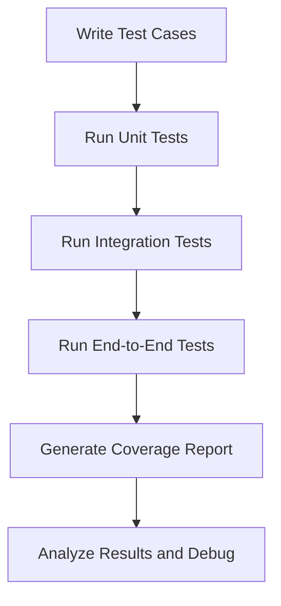

# 🏦 Core Banking System Test Suite

This directory contains the comprehensive test suite for the Core Banking System (CBS). It includes unit tests, integration tests, and end-to-end tests to ensure the reliability and robustness of the system.

---

## 🧪 Test Categories

| **Category**       | **Description**                                                                 | **Key Features**                                                                 |
|---------------------|---------------------------------------------------------------------------------|----------------------------------------------------------------------------------|
| **Unit Tests**      | Test individual components in isolation.                                        | 📂 Database Unit Tests, 🛠️ Model Unit Tests, 🔧 Utility Function Tests           |
| **Integration Tests** | Test interactions between components.                                           | 🔗 Database Connection Tests, 🌐 API Endpoint Tests, 🤝 Component Interaction Tests |
| **End-to-End Tests** | Simulate real-world workflows to test the system as a whole.                   | 📊 Database Workflow Tests, 📈 Business Process Tests                            |

---

## 🛠️ Test Workflow



---

## 🚀 Running Tests

You can use `pytest` or the provided `run_tests.py` script to run the tests.

### Using `pytest`
```bash
# Run all tests
pytest

# Run tests in a specific directory
pytest tests/unit
pytest tests/integration
pytest tests/e2e

# Run a specific test file
pytest tests/unit/test_utils.py
```

### Using `run_tests.py`
```bash
# Run all tests
python -m tests.run_tests --all

# Run specific categories
python -m tests.run_tests --unit
python -m tests.run_tests --integration
python -m tests.run_tests --e2e

# Generate coverage report
python -m tests.run_tests --all --coverage
```

---

## 🐞 Debugging Tests

### Debugging with `pytest`
Use the `--pdb` flag to drop into the Python debugger on test failure:
```bash
pytest --pdb
```

### Debugging with `unittest`
Use the `-m pdb` flag to debug specific tests:
```bash
python -m unittest tests.unit.test_utils.TestUtils.test_calculate_interest -m pdb
```

---

## 📊 Coverage Report

Generate a coverage report to identify untested parts of the code:
```bash
pytest --cov=app --cov-report=html
```
The report will be saved in the `htmlcov` directory.

---

## ⚙️ Prerequisites

| **Requirement**       | **Description**                                                                 |
|------------------------|---------------------------------------------------------------------------------|
| 🗄️ **Database**        | Ensure the test database is running with the correct schema.                   |
| 🔑 **Environment Variables** | Set up necessary environment variables.                                      |
| 🌐 **API Server**      | Start the API server for API-dependent tests: `python run_api.py`.             |

---

## ➕ Adding New Tests

1. Follow the existing directory structure and naming conventions.
2. Use fixtures from `conftest.py` where applicable.
3. Ensure tests clean up after themselves.
4. Add appropriate documentation and examples.

---

## 🔍 Test Snippets

### Mocking External Services
```python
from unittest.mock import patch

@patch('external_service.get_data')
def test_service(mock_get_data):
    mock_get_data.return_value = {'key': 'value'}
    result = my_function()
    assert result == 'expected_value'
```

### Parameterized Tests
```python
import pytest

@pytest.mark.parametrize('input,expected', [
    (1, 2),
    (2, 3),
    (3, 4),
])
def test_increment(input, expected):
    assert increment(input) == expected
```

### Database Setup
```python
from database import get_db_session

def test_database():
    session = get_db_session()
    session.add(MyModel(name='test'))
    session.commit()
    result = session.query(MyModel).filter_by(name='test').first()
    assert result is not None
```

---

## ✅ Conclusion

This test suite ensures the reliability and robustness of the Core Banking System. Follow the guidelines above to run, debug, and extend the tests effectively.
