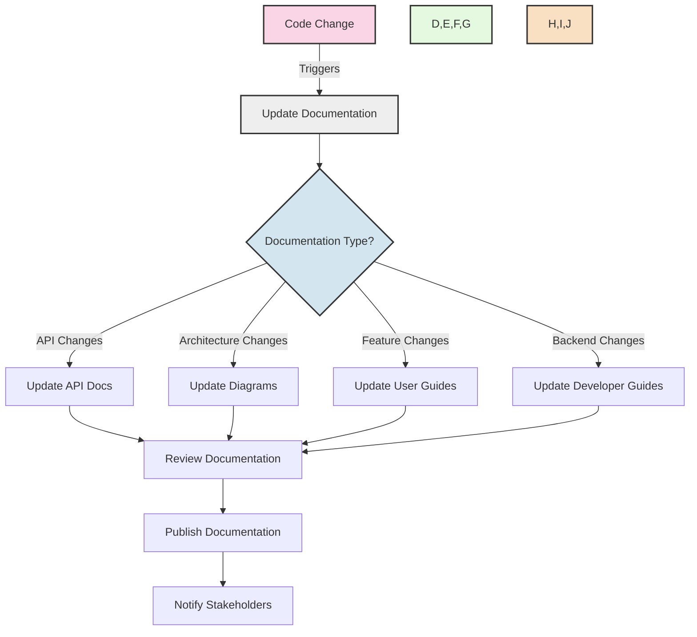
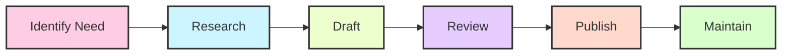

# Core Banking System Documentation 📚

<div align="center">


</div>

Welcome to the Core Banking System (CBS_PYTHON) documentation. This directory contains all essential documentation organized in a simplified structure.

## 📂 Directory Structure

```
Documentation/
├── technical/              # Technical documentation for developers
│   ├── standards/         # Technical specifications and standards
│   ├── guides/            # Implementation and development guides
│   └── development/       # Development-specific documentation
│
├── user/                   # User manuals and guides
│   ├── manuals/           # Detailed user manuals by role
│   ├── tutorials/         # Step-by-step tutorials
│   └── faq/               # Frequently asked questions
│
├── architecture/           # System architecture and design documents
│   ├── diagrams/          # Architecture diagrams and visuals
│   ├── design/            # Design specifications
│   └── patterns/          # Design patterns and implementations
│
└── api/                    # API documentation and integration guides
    ├── reference/         # API reference documentation
    ├── integration/       # Integration guides
    └── versioning/        # API versioning information
```

## Overview

The Core Banking System (CBS_PYTHON) is a comprehensive banking solution that provides all essential banking functions including account management, transactions, loans, and digital banking channels.

## Getting Started 🚀

For installation and setup instructions, please refer to the main README.md file in the project root directory.

_Last updated: May 23, 2025_

## 🔍 Documentation Categories

| Category | Description | Primary Audience |
|----------|-------------|-----------------|
| **🧪 Technical** | Development standards, implementation guides | Developers |
| **👥 User** | User manuals, tutorials, FAQ | End Users, Administrators |
| **🏗️ Architecture** | System design, patterns, diagrams | Architects, Developers |
| **🔌 API** | API references, integration guides | Integrators, Developers |

## 📋 Documentation Standards

All documentation should follow these standards:

1. ✅ All documentation should be in Markdown format (.md)
2. ✅ API documentation should follow OpenAPI specifications
3. ✅ Architecture diagrams should be in PNG and source format (draw.io)
4. ✅ All documents should be versioned with date in format YYYY-MM-DD
5. ✅ Code examples should be properly formatted with syntax highlighting
6. ✅ Screenshots should be provided where helpful (PNG format)
7. ✅ Keep documentation up to date with code changes

## 🚀 Documentation Flow



## 📝 Documentation Creation Process

<div align="center">



</div>

## ✅ Documentation Readiness Checklist

Before considering documentation complete, ensure:

- [x] All public APIs are documented with examples
- [x] User guides cover all end-user functionality
- [x] Developer guides explain how to extend and maintain the system
- [x] Clean Architecture principles are clearly documented
- [x] System configuration documentation is complete
- [x] CLI documentation includes examples for all commands
- [x] Technical diagrams are up to date with current architecture

## 📊 Documentation Completeness

<div align="center">

| Section | Completeness | Last Updated |
|---------|--------------|-------------|
| API Documentation |  | 2025-05-23 |
| Architecture Diagrams |  | 2025-05-23 |
| Clean Architecture |  | 2025-05-23 |
| CLI Documentation |  | 2025-05-23 |
| Developer Guides |  | 2025-05-23 |
| System Configuration |  | 2025-05-23 |
| Technical Standards |  | 2025-05-23 |
| User Guides |  | 2025-05-23 |

</div>

## 🔗 Quick Links

- [Clean Architecture Implementation Progress](../CLEAN_ARCHITECTURE_PROGRESS.md)
- [Contributing Guidelines](../CONTRIBUTING.md)
- [CLI User Guide](user/manuals/CLI_USER_GUIDE.md)
- [API Documentation](api/README.md)
- [Developer Setup Guide](technical/guides/GETTING_STARTED.md)
- [Migration Summary](MIGRATION_SUMMARY.md)

## 🛠️ Documentation Tools

The following tools are available for maintaining the documentation:

1. `maintain_documentation.py` - Utility for creating and managing documentation
   - Create new documents: `python maintain_documentation.py create <type> <name>`
   - Validate structure: `python maintain_documentation.py validate`
   - List documents: `python maintain_documentation.py list [type]`

2. `fix_broken_links.py` - Scan and fix broken links

3. `validate_content.py` - Analyze content quality and completeness

## 🌟 Contributors

<div align="center">

<a href="https://github.com/Soumya-r-Sahu/CBS_PYTHON/graphs/contributors">
  
</a>

</div>

---

<div align="center">

  [](https://github.com/Soumya-r-Sahu/CBS_PYTHON)

  **Made with ❤️ by the CBS Python Team**

</div>
