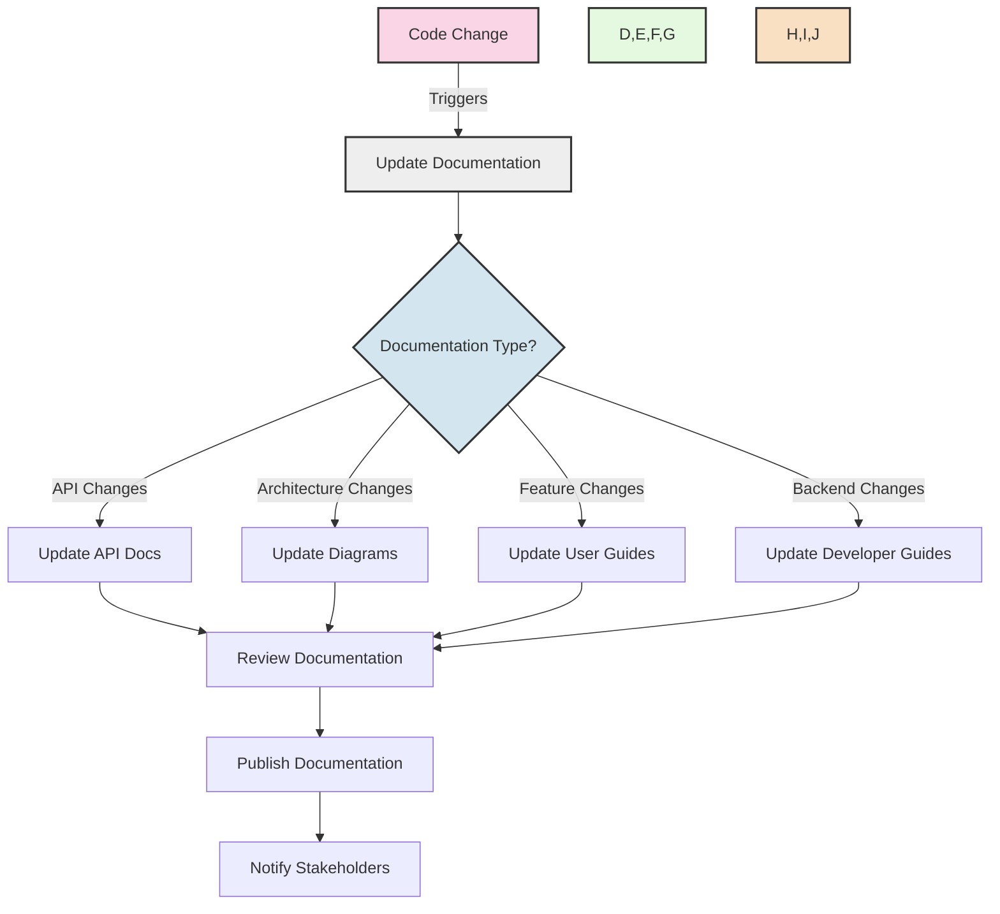
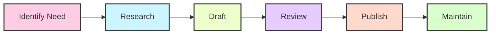

# Core Banking System Documentation 📚

<div align="center">


[](https://github.com/Soumya-r-Sahu/CBS_PYTHON/blob/main/LICENSE)
[](https://github.com/Soumya-r-Sahu/CBS_PYTHON/blob/main/CONTRIBUTING.md)

</div>

This directory contains all the documentation for the Core Banking System, organized by type:

## 📂 Directory Structure

```
documentation/
├── api/                       # API interface documentation
├── architecture_diagrams/     # System architecture diagrams
├── clean_architecture/        # Clean Architecture implementation guides
├── cli/                       # Command Line Interface documentation
├── developer_guides/          # Technical guides for developers
├── system_configuration/      # System configuration details
├── technical_standards/       # Technical specifications and standards
└── user_guides/               # End-user documentation
```

## 🔍 Documentation Categories

| Category | Description | Primary Audience | Formats |
|----------|-------------|-----------------|---------|
| **📘 API** | OpenAPI specifications, endpoint documentation | Developers, Integrators | Markdown, YAML |
| **🏗️ Architecture Diagrams** | System architecture and component diagrams | Architects, Developers | PNG, Draw.io |
| **🧩 Clean Architecture** | Implementation guides and principles | Developers | Markdown |
| **💻 CLI** | Command-line interface documentation | Operators, Developers | Markdown |
| **👨‍💻 Developer Guides** | Implementation instructions, coding standards | Developers | Markdown |
| **⚙️ System Configuration** | Configuration files, environment setup | DevOps, Operators | Markdown, YAML |
| **📊 Technical Standards** | Specifications, protocols, standards | Developers, Architects | Markdown |
| **🔰 User Guides** | Quick-start guides for different user roles | End Users | Markdown |

## 📋 Documentation Standards

All documentation should follow these standards:

1. ✅ All documentation should be in Markdown format (.md)
2. ✅ API documentation should follow OpenAPI specifications
3. ✅ Architecture diagrams should be in PNG and source format (draw.io)
4. ✅ All documents should be versioned with date in format YYYY-MM-DD
5. ✅ Code examples should be properly formatted with syntax highlighting
6. ✅ Screenshots should be provided where helpful (PNG format)
7. ✅ Keep documentation up to date with code changes

## 🚀 Documentation Flow



## 📝 Documentation Creation Process

<div align="center">



</div>

## ✅ Documentation Readiness Checklist

Before considering documentation complete, ensure:

- [ ] All public APIs are documented with examples
- [ ] User guides cover all end-user functionality
- [ ] Developer guides explain how to extend and maintain the system
- [ ] Clean Architecture principles are clearly documented
- [ ] System configuration documentation is complete
- [ ] CLI documentation includes examples for all commands
- [ ] Technical diagrams are up to date with current architecture

## 📊 Documentation Completeness

<div align="center">

| Section | Completeness | Last Updated |
|---------|--------------|-------------|
| API Documentation |  | 2025-05-10 |
| Architecture Diagrams |  | 2025-05-12 |
| Clean Architecture |  | 2025-05-15 |
| CLI Documentation |  | 2025-05-14 |
| Developer Guides |  | 2025-05-16 |
| System Configuration |  | 2025-05-17 |
| Technical Standards |  | 2025-05-09 |
| User Guides |  | 2025-05-15 |

</div>

## 🔗 Quick Links

- [Clean Architecture Implementation Progress](../CLEAN_ARCHITECTURE_PROGRESS.md)
- [Contributing Guidelines](../CONTRIBUTING.md)
- [CLI User Guide](cli/cli_user_guide.md)
- [API Documentation](api/api_overview.md)
- [Developer Setup Guide](developer_guides/getting_started.md)
- [System Configuration](system_configuration/README.md)

## 🌟 Contributors

<div align="center">

<a href="https://github.com/Soumya-r-Sahu/CBS_PYTHON/graphs/contributors">
  
</a>

</div>

---

<div align="center">
  
  [](https://github.com/Soumya-r-Sahu/CBS_PYTHON)
  
  **Made with ❤️ by the CBS Python Team**
  
</div>
