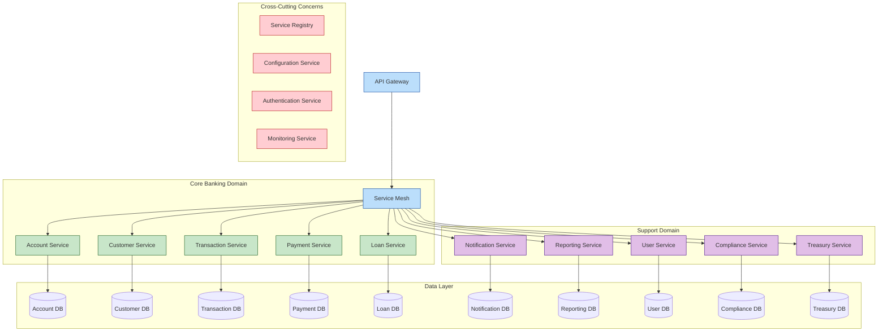

# Microservices Migration Strategy

  

## 📋 Executive Summary

This document outlines the strategy for migrating the CBS_PYTHON banking system from its current monolithic architecture to a microservices-based architecture. This migration will enable greater scalability, maintainability, and deployment flexibility while ensuring business continuity throughout the transition.

## 🎯 Migration Objectives

- Improve system scalability and fault isolation
- Enable independent deployment of banking modules
- Enhance development team autonomy and productivity
- Reduce technical debt through well-defined service boundaries
- Ensure business continuity with zero downtime migration
- Improve observability and operational efficiency

## 🏗️ Current Architecture Assessment

### Monolithic Components

The current CBS_PYTHON system operates primarily as a monolith with the following key characteristics:

- Tightly coupled core banking modules (accounts, loans, transactions)
- Shared database schemas across multiple functional domains
- Synchronous communication between system components
- Single deployment lifecycle for all functionality
- Limited isolation between critical and non-critical functions

### Pain Points

- Scaling challenges during peak transaction periods
- Extended deployment windows and coordination overhead
- Difficulty isolating failures in production environments
- Development bottlenecks with multiple teams working on shared codebase
- Long-running database transactions affecting overall system performance
- Testing complexity and increased regression risk

## 🛣️ Migration Approach: Strangler Fig Pattern

We will adopt the Strangler Fig migration pattern to gradually transition the monolith to microservices:

```mermaid
graph TD
    A[Client Requests] --> B[API Gateway / Load Balancer]
    B --> C{Route Determination}
    C -->|Legacy Routes| D[Monolith CBS_PYTHON]
    C -->|Migrated Routes| E[Microservices]
    
    subgraph "Progressive Migration"
        E --> M1[Accounts Microservice]
        E --> M2[Payments Microservice]
        E --> M3[Customers Microservice]
        E --> M4[Loans Microservice]
        E --> M5[..."Future Microservices"]
    end
    
    D --> F[Shared Database]
    M1 --> G1[Accounts DB]
    M2 --> G2[Payments DB]
    M3 --> G3[Customers DB]
    M4 --> G4[Loans DB]
    
    style A fill:#bbdefb,stroke:#0d47a1
    style B fill:#bbdefb,stroke:#0d47a1
    style C fill:#ffcdd2,stroke:#b71c1c
    style D fill:#ffe0b2,stroke:#e65100
    style E fill:#c8e6c9,stroke:#1b5e20
    style F fill:#ffe0b2,stroke:#e65100
    style G1 fill:#c8e6c9,stroke:#1b5e20
    style G2 fill:#c8e6c9,stroke:#1b5e20
    style G3 fill:#c8e6c9,stroke:#1b5e20
    style G4 fill:#c8e6c9,stroke:#1b5e20
    style M1 fill:#c8e6c9,stroke:#1b5e20
    style M2 fill:#c8e6c9,stroke:#1b5e20
    style M3 fill:#c8e6c9,stroke:#1b5e20
    style M4 fill:#c8e6c9,stroke:#1b5e20
    style M5 fill:#c8e6c9,stroke:#1b5e20
```

### Key Migration Phases:

1. **Foundation Setup (Q2 2025)**
   - Implement API gateway and service registry
   - Establish CI/CD pipeline for microservices
   - Set up observability infrastructure
   - Develop service mesh for inter-service communication

2. **Domain Identification (Q3 2025)**
   - Analyze business domains and bounded contexts
   - Define service boundaries and responsibilities
   - Map data ownership and access patterns
   - Identify domain events and integration points

3. **Incremental Extraction (Q4 2025 - Q3 2026)**
   - Extract microservices one domain at a time
   - Begin with less critical domains (reporting, notifications)
   - Progress to core domains (accounts, payments, customers)
   - Maintain backward compatibility throughout

4. **Database Decomposition (Ongoing)**
   - Implement Command Query Responsibility Segregation (CQRS) where appropriate
   - Create service-specific databases for extracted services
   - Manage dual-write/dual-read patterns during transition
   - Implement eventual consistency patterns for cross-domain queries

5. **Completion and Optimization (Q4 2026)**
   - Decommission monolith components
   - Optimize service communication patterns
   - Fine-tune performance and scalability
   - Enhance developer experience and tools

## 🔍 Domain Service Map

The following domains will be extracted into separate microservices:

| Domain | Service Name | Priority | Complexity | Dependencies | Timeline |
|--------|--------------|----------|------------|--------------|----------|
| Customer Management | customer-service | High | Medium | None | Q3 2025 |
| Account Management | account-service | High | High | customer-service | Q4 2025 |
| Transactions | transaction-service | High | High | account-service | Q4 2025 |
| Payments | payment-service | High | High | account-service, transaction-service | Q1 2026 |
| Loans | loan-service | Medium | High | customer-service, account-service | Q1 2026 |
| Reporting | reporting-service | Low | Medium | All services (read-only) | Q2 2026 |
| Notifications | notification-service | Medium | Low | All services (events) | Q3 2025 |
| User Management | user-service | Medium | Medium | None | Q3 2025 |
| Treasury | treasury-service | Low | High | account-service, transaction-service | Q2 2026 |
| Risk & Compliance | compliance-service | Medium | Medium | All services (read-only) | Q3 2026 |

## 🏛️ Target Architecture



## 🔧 Technical Implementation Strategy

### Service Implementation

Each microservice will be implemented with:

- Python FastAPI for service endpoints
- Event-driven architecture for asynchronous communication
- Domain-Driven Design principles
- Clean Architecture implementation
- Independent CI/CD pipelines
- Service-specific databases (PostgreSQL, MongoDB based on use case)

### Interservice Communication

- **Synchronous**: REST APIs for queries and commands requiring immediate response
- **Asynchronous**: Kafka-based event streaming for cross-domain events
- **Service Discovery**: Consul for service registration and discovery
- **API Gateway**: Kong/Traefik for routing, authentication, and rate limiting

### Data Strategy

- **Database per Service**: Each service owns its data store
- **Data Replication**: Read replicas for reporting and analytics
- **CQRS Pattern**: Separate read and write models for complex domains
- **Event Sourcing**: For core transactional domains requiring audit trails
- **Data Migration**: Incremental migration with dual-write patterns

## 📊 Migration Phases in Detail

### Phase 1: Foundation (Q2 2025)

| Task | Description | Duration | Dependencies |
|------|-------------|----------|--------------|
| API Gateway Setup | Implement Kong API Gateway | 2 weeks | None |
| Service Mesh | Implement Istio service mesh | 3 weeks | None |
| CI/CD Pipeline | Set up Jenkins/GitHub Actions pipelines | 2 weeks | None |
| Monitoring | Implement Prometheus, Grafana, ELK stack | 3 weeks | None |
| Service Template | Create microservice template with FastAPI | 2 weeks | None |
| Event Bus | Set up Kafka clusters | 2 weeks | None |

### Phase 2: Domain Extraction (Q3 2025 - Q3 2026)

For each domain:

1. **Analyze**: Map domain model and integrations (2 weeks)
2. **Decouple**: Refactor monolith for clean separation (3-4 weeks)
3. **Build**: Implement microservice using template (4-6 weeks)
4. **Test**: Comprehensive testing (2-3 weeks)
5. **Deploy**: Parallel run with traffic splitting (2 weeks)
6. **Migrate**: Gradual traffic shift to new service (2-4 weeks)
7. **Decommission**: Remove code from monolith (1 week)

### Phase 3: Optimization (Q4 2026)

| Task | Description | Duration | Dependencies |
|------|-------------|----------|--------------|
| Performance Tuning | Optimize service performance | 4 weeks | All services migrated |
| Resilience Enhancement | Implement circuit breakers, bulkheads | 3 weeks | All services migrated |
| Scalability Testing | Load testing in production-like environment | 3 weeks | Performance tuning |
| Documentation | Updated architecture documentation | 2 weeks | All previous tasks |
| Developer Tools | Enhanced tooling for service development | 3 weeks | None |

## 🔐 Risk Management

| Risk | Impact | Likelihood | Mitigation |
|------|--------|------------|------------|
| Business disruption | High | Medium | Blue/green deployments, feature flags, rollback capability |
| Data consistency issues | High | Medium | Dual-write patterns, consistency verification tools |
| Performance degradation | Medium | Medium | Performance testing, gradual migration, monitoring |
| Team skill gaps | Medium | High | Training, hiring specialists, external consulting |
| Extended transition period | Medium | High | Prioritize high-value domains, incremental approach |
| Integration challenges | Medium | High | Comprehensive integration testing, service contracts |
| Operational complexity | Medium | Medium | Robust monitoring, automated scaling and recovery |

## 📝 Governance and Coordination

### Team Structure

- **Platform Team**: Responsible for infrastructure, CI/CD, monitoring
- **Domain Teams**: Cross-functional teams per business domain
- **Integration Team**: Ensures compatibility across services
- **Architecture Team**: Provides guidance and governance

### Migration Decision Framework

For each domain being considered for extraction:

1. **Business Value Assessment**: Impact on customer experience and business goals
2. **Technical Feasibility**: Ease of extraction from monolith
3. **Dependency Mapping**: Identification of cross-domain dependencies
4. **Resource Requirements**: Team capacity and expertise needed
5. **Migration Strategy**: Specific approach for the domain

## 📈 Success Metrics

| Metric | Description | Target | Measurement Method |
|--------|-------------|--------|-------------------|
| Deployment Frequency | Number of deployments per service per month | >10 | CI/CD metrics |
| Lead Time | Time from commit to production | <24 hours | CI/CD metrics |
| Mean Time to Recovery | Average time to recover from failures | <30 minutes | Incident reports |
| Change Failure Rate | Percentage of deployments causing issues | <5% | Deployment analytics |
| System Availability | Uptime percentage | >99.99% | Monitoring system |
| Service Independence | Percentage of services deployable independently | 100% | Architecture review |
| Team Autonomy | Teams able to deploy without coordination | 100% | Developer survey |

## 🎓 Team Training Plan

| Training | Description | Target Audience | Timeline |
|----------|-------------|-----------------|----------|
| Microservices Architecture | Patterns and principles | All developers | Q2 2025 |
| Domain-Driven Design | Strategic and tactical DDD | Domain team leads | Q2 2025 |
| Event-Driven Architecture | Patterns and implementation | All developers | Q3 2025 |
| Cloud-Native Development | Kubernetes, containers, orchestration | Platform team | Q2 2025 |
| Observability | Monitoring, logging, tracing | All teams | Q3 2025 |
| API Design | REST, GraphQL, API versioning | Domain teams | Q3 2025 |

## 🔄 Iterative Validation Approach

For each microservice extraction:

1. **Proof of Concept**: Small-scale implementation to validate approach
2. **Pilot Implementation**: Controlled user group testing
3. **Gradual Rollout**: Phased migration of user traffic
4. **Full Deployment**: Complete migration with monitoring
5. **Retrospective**: Lessons learned and process improvement

## 📋 Approval & Sign-off

| Role | Name | Status | Date |
|------|------|--------|------|
| CTO | | Pending | |
| Chief Architect | | Pending | |
| Head of Engineering | | Pending | |
| Product Owner | | Pending | |
| Operations Lead | | Pending | |