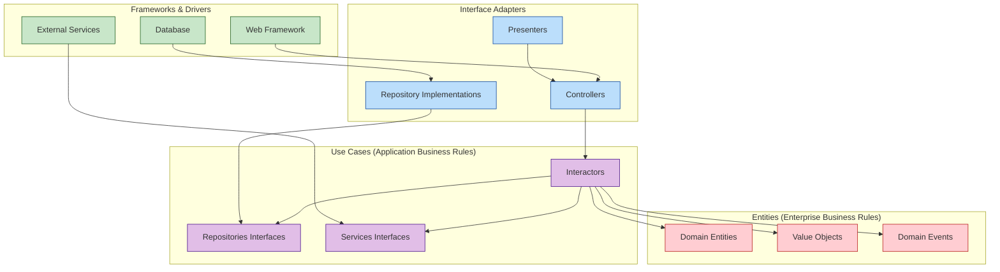
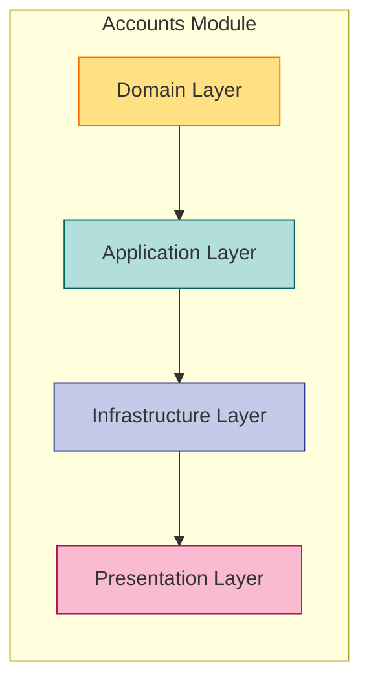
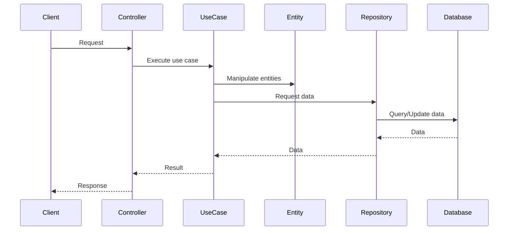
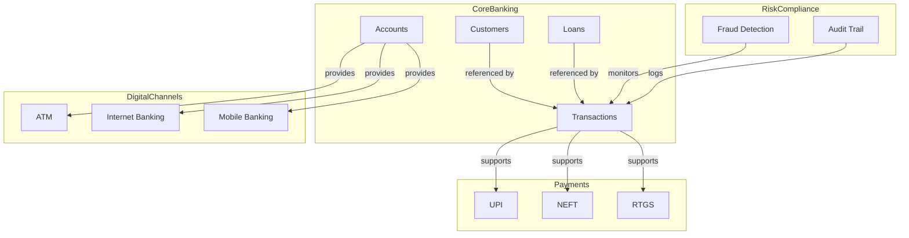

# Clean Architecture Diagrams

This document provides visual representations of the Clean Architecture implementation in the CBS_PYTHON project.

---

## 🏗️ Clean Architecture Dependency Flow

*This Mermaid diagram illustrates the Clean Architecture dependency flow. Dependencies always point inward, ensuring separation of concerns and testability.*

---

## 📦 CBS Module Architecture Example

*This diagram shows the Clean Architecture layering in the Accounts module.*

---

## 🔄 Component Interaction Flow

*This sequence diagram illustrates the flow of a typical operation across Clean Architecture layers.*

---

## 🧩 Module Relationships

*This diagram shows the relationships between major modules in CBS_PYTHON.*

---

## 📈 Implementation Status (as of May 17, 2025)

| Module                | Status        |
|-----------------------|--------------|
| Accounts              | ✅ Complete   |
| Customers             | ✅ Complete   |
| Loans                 | ✅ Complete   |
| Transactions          | ✅ Complete   |
| ATM                   | ✅ Complete   |
| Internet Banking      | 🟠 In Progress|
| Mobile Banking        | 🟠 In Progress|
| UPI                   | ✅ Complete   |
| NEFT                  | 🟠 In Progress|
| RTGS                  | 🟡 Planned    |
| Fraud Detection       | 🟠 In Progress|
| Audit Trail           | ✅ Complete   |
| BI Dashboards         | 🟠 In Progress|

---

> **Last updated:** May 17, 2025