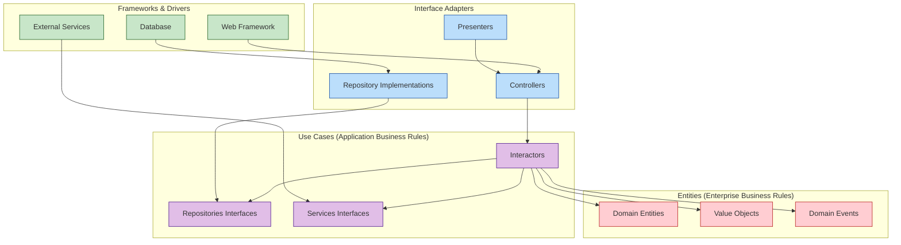
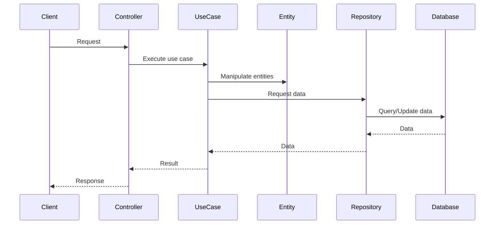
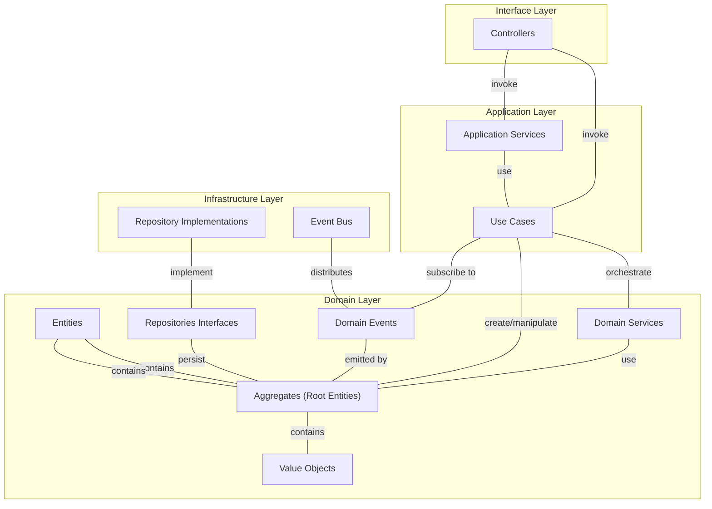

# 🧩 Clean Architecture in CBS_PYTHON

  

## 📖 Overview

This documentation provides guidelines for implementing the Clean Architecture pattern in the CBS_PYTHON core banking system. Clean Architecture emphasizes separation of concerns and dependency rules that make the system more maintainable, testable, and independent of frameworks, UI, and databases.

## 🏗️ Architectural Layers



## 🔍 Core Principles

1. **👉 Dependency Rule**: Dependencies always point inward. Inner layers know nothing about outer layers.
2. **🧪 Testability**: Business rules can be tested without UI, database, web server, or any external element.
3. **💫 Independence**: Independent of frameworks. The architecture does not depend on the existence of some library.
4. **🔄 Isolation**: The UI can change easily, without changing the rest of the system.
5. **🔌 Database Independence**: Your business rules don't depend on the database, so you can swap out Oracle or SQL Server for MongoDB, BigTable, or CouchDB.

## 📊 Implementation Progress

| Module | Domain Layer | Use Case Layer | Interface Layer | Status |
|--------|--------------|----------------|-----------------|--------|
| 🏦 **Accounts** |  |  |  |  |
| 👤 **Customer Management** |  |  |  |  |
| 💸 **Transactions** |  |  |  |  |
| 💰 **Loans** |  |  |  |  |
| 💱 **Foreign Exchange** |  |  |  |  |
| 📊 **Reporting** | 🟨🟨🟨🟨🟨🟨🟨⬜⬜⬜ 70% | 🟨🟨🟨⬜⬜⬜⬜⬜⬜⬜ 50% | 🟨🟨⬜⬜⬜⬜⬜⬜⬜⬜ 30% | 🟡 In Progress |

## 📂 Directory Structure

Each module follows this structure to maintain clean architecture:

```
module_name/
├── domain/                  # Enterprise Business Rules
│   ├── entities/            # Domain objects
│   ├── value_objects/       # Immutable value objects
│   ├── exceptions/          # Domain-specific exceptions
│   └── events/              # Domain events
├── application/             # Application Business Rules
│   ├── use_cases/           # Use cases/interactors
│   ├── interfaces/          # Repository and service interfaces
│   ├── dtos/                # Data Transfer Objects
│   └── exceptions/          # Application-specific exceptions
├── infrastructure/          # Interface Adapters
│   ├── repositories/        # Repository implementations
│   ├── services/            # Service implementations
│   ├── mappers/             # Object mappers
│   └── exceptions/          # Infrastructure-specific exceptions
└── interfaces/              # Frameworks & Drivers
    ├── api/                 # REST API
    ├── cli/                 # Command line interface
    ├── web/                 # Web interface
    └── messaging/           # Messaging interface
```

## 🔄 Flow of Control



## 💻 Implementation Examples

### 1️⃣ Domain Layer Example (Entity)

```python
# core_banking/accounts/domain/entities/account.py
from dataclasses import dataclass
from decimal import Decimal
from datetime import datetime
from uuid import UUID
from typing import List

from core_banking.accounts.domain.value_objects import Currency, AccountStatus
from core_banking.accounts.domain.events import AccountCreatedEvent, AccountDebitedEvent

@dataclass
class Account:
    id: UUID
    customer_id: UUID
    account_number: str
    currency: Currency
    balance: Decimal
    status: AccountStatus
    created_at: datetime
    updated_at: datetime
    events: List = field(default_factory=list)
    
    def debit(self, amount: Decimal, transaction_id: UUID) -> None:
        """Debit the account by the specified amount."""
        if self.status != AccountStatus.ACTIVE:
            raise AccountNotActiveError(f"Account {self.account_number} is not active")
            
        if amount <= 0:
            raise InvalidAmountError("Debit amount must be positive")
            
        if self.balance < amount:
            raise InsufficientFundsError(f"Insufficient funds in account {self.account_number}")
            
        self.balance -= amount
        self.updated_at = datetime.now()
        
        # Add domain event
        self.events.append(AccountDebitedEvent(
            account_id=self.id,
            transaction_id=transaction_id,
            amount=amount,
            balance=self.balance,
            timestamp=self.updated_at
        ))
        
    def credit(self, amount: Decimal, transaction_id: UUID) -> None:
        """Credit the account by the specified amount."""
        if self.status != AccountStatus.ACTIVE:
            raise AccountNotActiveError(f"Account {self.account_number} is not active")
            
        if amount <= 0:
            raise InvalidAmountError("Credit amount must be positive")
            
        self.balance += amount
        self.updated_at = datetime.now()
        
        # Add domain event
        self.events.append(AccountCreditedEvent(
            account_id=self.id,
            transaction_id=transaction_id,
            amount=amount,
            balance=self.balance,
            timestamp=self.updated_at
        ))
```

### 2️⃣ Application Layer Example (Use Case)

```python
# core_banking/accounts/application/use_cases/transfer_funds.py
from dataclasses import dataclass
from decimal import Decimal
from uuid import UUID, uuid4
import datetime

from core_banking.accounts.application.interfaces.account_repository import AccountRepository
from core_banking.accounts.application.interfaces.transaction_repository import TransactionRepository
from core_banking.accounts.application.dtos import TransferFundsInput, TransferFundsOutput
from core_banking.accounts.domain.entities import Transaction, TransactionType
from core_banking.accounts.domain.exceptions import BusinessRuleViolationError

class TransferFundsUseCase:
    def __init__(
        self, 
        account_repository: AccountRepository,
        transaction_repository: TransactionRepository
    ):
        self.account_repository = account_repository
        self.transaction_repository = transaction_repository
        
    def execute(self, input_dto: TransferFundsInput) -> TransferFundsOutput:
        # Create transaction ID
        transaction_id = uuid4()
        
        # Get accounts
        source_account = self.account_repository.get_by_id(input_dto.source_account_id)
        target_account = self.account_repository.get_by_id(input_dto.target_account_id)
        
        if source_account is None:
            raise AccountNotFoundError(f"Source account {input_dto.source_account_id} not found")
            
        if target_account is None:
            raise AccountNotFoundError(f"Target account {input_dto.target_account_id} not found")
        
        # Perform the transfer
        try:
            # Debit source account
            source_account.debit(input_dto.amount, transaction_id)
            
            # Credit target account
            target_account.credit(input_dto.amount, transaction_id)
            
            # Create transaction record
            transaction = Transaction(
                id=transaction_id,
                type=TransactionType.TRANSFER,
                source_account_id=source_account.id,
                target_account_id=target_account.id,
                amount=input_dto.amount,
                currency=source_account.currency,
                description=input_dto.description,
                status=TransactionStatus.COMPLETED,
                created_at=datetime.now(),
                updated_at=datetime.now()
            )
            
            # Save everything
            self.account_repository.save(source_account)
            self.account_repository.save(target_account)
            self.transaction_repository.save(transaction)
            
            # Process domain events
            for event in source_account.events + target_account.events:
                self.event_dispatcher.dispatch(event)
                
            # Clear events after processing
            source_account.events.clear()
            target_account.events.clear()
            
            return TransferFundsOutput(
                transaction_id=transaction_id,
                source_account_id=source_account.id,
                target_account_id=target_account.id,
                amount=input_dto.amount,
                status=TransactionStatus.COMPLETED,
                timestamp=transaction.created_at
            )
            
        except BusinessRuleViolationError as e:
            # Handle business rule violations
            # Log error and create failed transaction record
            
            transaction = Transaction(
                id=transaction_id,
                type=TransactionType.TRANSFER,
                source_account_id=source_account.id,
                target_account_id=target_account.id,
                amount=input_dto.amount,
                currency=source_account.currency,
                description=input_dto.description,
                status=TransactionStatus.FAILED,
                error_message=str(e),
                created_at=datetime.now(),
                updated_at=datetime.now()
            )
            
            self.transaction_repository.save(transaction)
            
            # Re-raise the exception for the controller to handle
            raise
```

### 3️⃣ Infrastructure Layer Example (Repository)

```python
# core_banking/accounts/infrastructure/repositories/sql_account_repository.py
from typing import Optional, List
from uuid import UUID

from sqlalchemy.orm import Session

from core_banking.accounts.application.interfaces.account_repository import AccountRepository
from core_banking.accounts.domain.entities import Account
from core_banking.accounts.infrastructure.mappers import AccountMapper
from core_banking.accounts.infrastructure.models import AccountModel
from core_banking.database.connection import get_db_session

class SQLAccountRepository(AccountRepository):
    def __init__(self, session_factory=get_db_session):
        self.session_factory = session_factory
        
    def get_by_id(self, id: UUID) -> Optional[Account]:
        with self.session_factory() as session:
            account_model = session.query(AccountModel).filter(AccountModel.id == id).first()
            if account_model:
                return AccountMapper.to_entity(account_model)
            return None
            
    def get_by_account_number(self, account_number: str) -> Optional[Account]:
        with self.session_factory() as session:
            account_model = session.query(AccountModel).filter(
                AccountModel.account_number == account_number
            ).first()
            if account_model:
                return AccountMapper.to_entity(account_model)
            return None
            
    def get_by_customer_id(self, customer_id: UUID) -> List[Account]:
        with self.session_factory() as session:
            account_models = session.query(AccountModel).filter(
                AccountModel.customer_id == customer_id
            ).all()
            return [AccountMapper.to_entity(model) for model in account_models]
            
    def save(self, account: Account) -> Account:
        with self.session_factory() as session:
            account_model = session.query(AccountModel).filter(
                AccountModel.id == account.id
            ).first()
            
            if account_model:
                # Update existing account
                account_model = AccountMapper.update_model(account_model, account)
            else:
                # Create new account
                account_model = AccountMapper.to_model(account)
                session.add(account_model)
                
            session.commit()
            return AccountMapper.to_entity(account_model)
            
    def delete(self, id: UUID) -> None:
        with self.session_factory() as session:
            account_model = session.query(AccountModel).filter(AccountModel.id == id).first()
            if account_model:
                session.delete(account_model)
                session.commit()
```

### 4️⃣ Interface Layer Example (Controller)

```python
# core_banking/accounts/interfaces/api/transfer_funds_controller.py
from fastapi import APIRouter, Depends, HTTPException
from typing import Dict

from core_banking.accounts.application.use_cases import TransferFundsUseCase
from core_banking.accounts.application.dtos import TransferFundsInput
from core_banking.accounts.domain.exceptions import (
    AccountNotFoundError, 
    InsufficientFundsError,
    AccountNotActiveError
)
from core_banking.accounts.interfaces.api.schemas import (
    TransferFundsRequest,
    TransferFundsResponse
)
from core_banking.utils.di_container import get_container

router = APIRouter()

@router.post("/transfer", response_model=TransferFundsResponse)
async def transfer_funds(
    request: TransferFundsRequest,
    container = Depends(get_container)
):
    try:
        # Resolve dependencies
        use_case: TransferFundsUseCase = container.get(TransferFundsUseCase)
        
        # Create input DTO
        input_dto = TransferFundsInput(
            source_account_id=request.source_account_id,
            target_account_id=request.target_account_id,
            amount=request.amount,
            description=request.description
        )
        
        # Execute use case
        result = use_case.execute(input_dto)
        
        # Map to response
        return TransferFundsResponse(
            transaction_id=result.transaction_id,
            source_account_id=result.source_account_id,
            target_account_id=result.target_account_id,
            amount=result.amount,
            status=result.status,
            timestamp=result.timestamp
        )
        
    except AccountNotFoundError as e:
        raise HTTPException(status_code=404, detail=str(e))
        
    except InsufficientFundsError as e:
        raise HTTPException(status_code=400, detail=str(e))
        
    except AccountNotActiveError as e:
        raise HTTPException(status_code=400, detail=str(e))
        
    except Exception as e:
        # Log the unexpected error
        logger.error(f"Unexpected error in transfer_funds: {str(e)}")
        raise HTTPException(status_code=500, detail="Internal server error")
```

## 🧠 Dependency Injection

We use a dependency injection container to manage dependencies and maintain the Dependency Rule:

```python
# core_banking/utils/di_container.py
from dependency_injector import containers, providers

from core_banking.accounts.application.use_cases import TransferFundsUseCase
from core_banking.accounts.infrastructure.repositories import (
    SQLAccountRepository,
    SQLTransactionRepository
)

class Container(containers.DeclarativeContainer):
    # Configuration
    config = providers.Configuration()
    
    # Infrastructure
    db_session_factory = providers.Singleton(get_db_session)
    
    # Repositories
    account_repository = providers.Factory(
        SQLAccountRepository,
        session_factory=db_session_factory
    )
    
    transaction_repository = providers.Factory(
        SQLTransactionRepository,
        session_factory=db_session_factory
    )
    
    # Use Cases
    transfer_funds_use_case = providers.Factory(
        TransferFundsUseCase,
        account_repository=account_repository,
        transaction_repository=transaction_repository
    )

# Global container instance
_container = None

def get_container():
    global _container
    if _container is None:
        _container = Container()
        # Load configuration
        _container.config.from_dict({
            # Config values here
        })
    return _container
```

## 🌐 Domain-Driven Design Implementation

We combine Clean Architecture with Domain-Driven Design principles:



## ✅ Validation Checklist

When implementing or reviewing code, ensure:

- [ ] 🔄 Dependencies point inward (no imports from outer layers in inner layers)
- [ ] 🔍 Entities contain business rules and are independent
- [ ] 📝 Use cases contain application business logic
- [ ] 🧪 All code is testable in isolation
- [ ] 🛠️ Interfaces are clean and don't leak implementation details
- [ ] 📦 Repository interfaces are in the application layer
- [ ] 🔌 Repository implementations are in the infrastructure layer
- [ ] 📊 Domain events are used for cross-cutting concerns

## 🚀 Next Steps

1. Complete the implementation of all core modules
2. Refactor legacy code to follow Clean Architecture
3. Implement consistent error handling across layers
4. Enhance domain event system for better cross-module communication
5. Complete automated tests for all layers

---

<div align="center">
  
  **Last Updated: May 17, 2025**
  
  
  
  **Made with ❤️ by the CBS Python Team**
  
</div>