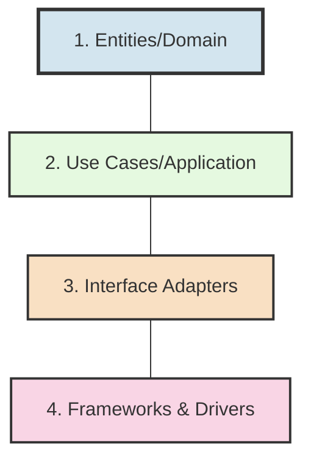
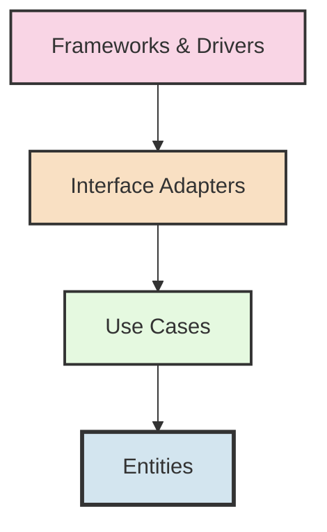

# 🏗️ Clean Architecture in CBS_PYTHON

<div align="center">


[](https://github.com/Soumya-r-Sahu/CBS_PYTHON/blob/main/LICENSE)
[](https://github.com/Soumya-r-Sahu/CBS_PYTHON)

A comprehensive guide to the Clean Architecture implementation in the Core Banking System

</div>

## 📑 Table of Contents

- [Overview](#-overview)
- [Core Principles](#-core-principles)
- [Layer Separation](#-layer-separation)
- [Dependency Flow](#-dependency-flow)
- [Module Structure](#-module-structure)
- [Implementation Examples](#-implementation-examples)
- [Testing Strategy](#-testing-strategy)
- [Interfaces & Ports](#-interfaces--ports)
- [Best Practices](#-best-practices)

## 🔍 Overview

The CBS_PYTHON system is built on Clean Architecture principles as defined by Robert C. Martin ("Uncle Bob"). This architectural approach ensures that our system is:

- ✅ **Testable**: Each component can be tested in isolation
- ✅ **Independent of Frameworks**: Business logic doesn't depend on external frameworks
- ✅ **Independent of UI**: Business logic doesn't know about the UI
- ✅ **Independent of Database**: Business logic doesn't know about the database
- ✅ **Independent of External Agencies**: Business logic doesn't know about external systems

## 🧩 Core Principles

<div align="center">

| Principle | Description | Implementation |
|-----------|-------------|----------------|
| **Dependency Rule** | Dependencies can only point inward | Enforced through imports and interfaces |
| **Separation of Concerns** | Each layer has a single responsibility | Maintained through strict module boundaries |
| **Boundary Interfaces** | Communication between layers happens through interfaces | Implemented with abstract base classes |
| **Domain-Driven Design** | Focus on the core domain and logic | Entities represent business concepts, use cases capture business logic |
| **Entity Isolation** | Entities are isolated from external concerns | No framework dependencies in entities |

</div>

## 🔄 Layer Separation

The architecture is divided into concentric layers:



### 1. 🏛️ Entities/Domain Layer

Contains enterprise-wide business rules and entities. These are the core business objects of the application.

```python
# Example Entity in Domain Layer
class Account:
    def __init__(self, account_id, customer_id, account_type, balance=0):
        self.account_id = account_id
        self.customer_id = customer_id
        self.account_type = account_type
        self.balance = balance
        self.status = "ACTIVE"
        self.created_at = datetime.now()
        
    def deposit(self, amount):
        if amount <= 0:
            raise ValueError("Deposit amount must be positive")
        self.balance += amount
        return True
        
    def withdraw(self, amount):
        if amount <= 0:
            raise ValueError("Withdrawal amount must be positive")
        if amount > self.balance:
            raise ValueError("Insufficient funds")
        self.balance -= amount
        return True
```

### 2. 📊 Use Cases/Application Layer

Contains application-specific business rules. Implements and orchestrates the high-level business rules defined in the domain layer.

```python
# Example Use Case in Application Layer
class CreateAccountUseCase:
    def __init__(self, account_repository, customer_repository, account_id_generator):
        self.account_repository = account_repository
        self.customer_repository = customer_repository
        self.account_id_generator = account_id_generator
        
    def execute(self, customer_id, account_type, initial_deposit=0):
        # Validate customer exists
        customer = self.customer_repository.get_by_id(customer_id)
        if not customer:
            raise CustomerNotFoundError(f"Customer with id {customer_id} not found")
            
        # Create account
        account_id = self.account_id_generator.generate()
        account = Account(account_id, customer_id, account_type, initial_deposit)
        
        # Save account
        self.account_repository.save(account)
        
        return account
```

### 3. 🔄 Interface Adapters Layer

Converts data between the use cases and external formats. Includes controllers, presenters, gateways, and repositories.

```python
# Example Repository in Interface Adapters Layer
class SQLAccountRepository(AccountRepository):
    def __init__(self, session_factory):
        self.session_factory = session_factory
        
    def get_by_id(self, account_id):
        with self.session_factory() as session:
            account_data = session.query(AccountModel).filter_by(account_id=account_id).first()
            if not account_data:
                return None
            return self._to_entity(account_data)
            
    def save(self, account):
        with self.session_factory() as session:
            account_data = self._to_model(account)
            session.add(account_data)
            session.commit()
            
    def _to_entity(self, model):
        return Account(
            account_id=model.account_id,
            customer_id=model.customer_id,
            account_type=model.account_type,
            balance=model.balance
        )
        
    def _to_model(self, entity):
        return AccountModel(
            account_id=entity.account_id,
            customer_id=entity.customer_id,
            account_type=entity.account_type,
            balance=entity.balance,
            status=entity.status
        )
```

### 4. 🖥️ Frameworks & Drivers Layer

Contains frameworks and tools such as the database, web frameworks, devices, etc. This is the most external layer.

```python
# Example Controller in Frameworks & Drivers Layer
@router.post("/accounts", response_model=AccountResponse)
def create_account(request: CreateAccountRequest, account_service: AccountService = Depends(get_account_service)):
    try:
        account = account_service.create_account(
            customer_id=request.customer_id,
            account_type=request.account_type,
            initial_deposit=request.initial_deposit
        )
        return AccountResponse(
            account_id=account.account_id,
            customer_id=account.customer_id,
            account_type=account.account_type,
            balance=account.balance,
            status=account.status
        )
    except CustomerNotFoundError as e:
        raise HTTPException(status_code=404, detail=str(e))
    except ValidationError as e:
        raise HTTPException(status_code=400, detail=str(e))
```

## ⬇️ Dependency Flow

The key to Clean Architecture is that dependencies can only point inward:

<div align="center">



</div>

The dependency inversion principle is applied at boundaries to ensure that:

- Outer layers depend on inner layers, never the reverse
- Inner layers define interfaces that outer layers must implement

## 📂 Module Structure

Each functional module in CBS_PYTHON follows this structure:

```
module_name/
├── domain/                  # Domain Layer
│   ├── entities/            # Business entities
│   ├── value_objects/       # Immutable value objects
│   └── repositories/        # Repository interfaces
├── application/             # Application Layer
│   ├── use_cases/           # Business use cases
│   ├── services/            # Domain services
│   └── interfaces/          # Service interfaces
├── infrastructure/          # Infrastructure Layer
│   ├── repositories/        # Repository implementations
│   ├── adapters/            # External service adapters
│   └── orm/                 # ORM models
└── presentation/            # Presentation Layer
    ├── api/                 # API routes & controllers
    ├── cli/                 # CLI commands
    └── dto/                 # Data Transfer Objects
```

## 🔎 Implementation Examples

### Repository Pattern

<div style="max-height: 300px; overflow: auto; border: 1px solid #ccc; padding: 10px; border-radius: 5px;">

```python
# Domain Layer: Repository Interface
from abc import ABC, abstractmethod

class CustomerRepository(ABC):
    @abstractmethod
    def get_by_id(self, customer_id):
        pass
    
    @abstractmethod
    def save(self, customer):
        pass
    
    @abstractmethod
    def update(self, customer):
        pass
    
    @abstractmethod
    def delete(self, customer_id):
        pass
    
    @abstractmethod
    def list(self, page=1, size=10, filters=None):
        pass

# Infrastructure Layer: Repository Implementation
from core_banking.customer_management.domain.repositories.customer_repository import CustomerRepository

class SQLCustomerRepository(CustomerRepository):
    def __init__(self, session_factory):
        self.session_factory = session_factory
    
    def get_by_id(self, customer_id):
        with self.session_factory() as session:
            customer_data = session.query(CustomerModel).filter_by(id=customer_id).first()
            if not customer_data:
                return None
            return self._to_entity(customer_data)
    
    # ... other methods implemented ...
```

</div>

### Use Case Implementation

<div style="max-height: 300px; overflow: auto; border: 1px solid #ccc; padding: 10px; border-radius: 5px;">

```python
# Application Layer: Use Case
from dataclasses import dataclass
from datetime import datetime
from core_banking.transactions.domain.entities.transaction import Transaction
from core_banking.accounts.domain.repositories.account_repository import AccountRepository
from core_banking.transactions.domain.repositories.transaction_repository import TransactionRepository

@dataclass
class TransferRequest:
    source_account_id: str
    destination_account_id: str
    amount: float
    reference: str

@dataclass
class TransferResponse:
    transaction_id: str
    source_account_id: str
    destination_account_id: str
    amount: float
    reference: str
    timestamp: datetime
    status: str

class TransferFundsUseCase:
    def __init__(
        self,
        account_repository: AccountRepository,
        transaction_repository: TransactionRepository,
        transaction_id_generator
    ):
        self.account_repository = account_repository
        self.transaction_repository = transaction_repository
        self.transaction_id_generator = transaction_id_generator
    
    def execute(self, request: TransferRequest) -> TransferResponse:
        # Get accounts
        source_account = self.account_repository.get_by_id(request.source_account_id)
        if not source_account:
            raise ValueError(f"Source account {request.source_account_id} not found")
        
        destination_account = self.account_repository.get_by_id(request.destination_account_id)
        if not destination_account:
            raise ValueError(f"Destination account {request.destination_account_id} not found")
        
        # Perform transfer
        source_account.withdraw(request.amount)
        destination_account.deposit(request.amount)
        
        # Create transaction record
        transaction_id = self.transaction_id_generator.generate()
        transaction = Transaction(
            transaction_id=transaction_id,
            source_account_id=request.source_account_id,
            destination_account_id=request.destination_account_id,
            amount=request.amount,
            reference=request.reference,
            transaction_type="TRANSFER",
            status="COMPLETED",
            timestamp=datetime.now()
        )
        
        # Save changes
        self.transaction_repository.save(transaction)
        self.account_repository.update(source_account)
        self.account_repository.update(destination_account)
        
        # Return result
        return TransferResponse(
            transaction_id=transaction.transaction_id,
            source_account_id=transaction.source_account_id,
            destination_account_id=transaction.destination_account_id,
            amount=transaction.amount,
            reference=transaction.reference,
            timestamp=transaction.timestamp,
            status=transaction.status
        )
```

</div>

## 🧪 Testing Strategy

Clean Architecture enables effective testing at all levels:

<div align="center">

| Layer | Test Type | Focus | Tools |
|-------|-----------|-------|-------|
| Domain | Unit | Business rules, entities | pytest, unittest |
| Application | Unit | Use cases, services | pytest, unittest |
| Infrastructure | Integration | Repositories, adapters | pytest, pytest-mock |
| Presentation | Integration | Controllers, views | pytest, requests |
| End-to-End | System | Complete flows | pytest, behave |

</div>

Example of testing a use case:

```python
def test_transfer_funds_use_case():
    # Arrange
    source_account = Account("ACC001", "CUST001", "SAVINGS", 1000)
    destination_account = Account("ACC002", "CUST002", "SAVINGS", 500)
    
    account_repository = MockAccountRepository()
    account_repository.save(source_account)
    account_repository.save(destination_account)
    
    transaction_repository = MockTransactionRepository()
    transaction_id_generator = MockIdGenerator("TRX001")
    
    use_case = TransferFundsUseCase(
        account_repository=account_repository,
        transaction_repository=transaction_repository,
        transaction_id_generator=transaction_id_generator
    )
    
    request = TransferRequest(
        source_account_id="ACC001",
        destination_account_id="ACC002",
        amount=200,
        reference="Test transfer"
    )
    
    # Act
    response = use_case.execute(request)
    
    # Assert
    assert response.transaction_id == "TRX001"
    assert response.status == "COMPLETED"
    
    updated_source = account_repository.get_by_id("ACC001")
    updated_destination = account_repository.get_by_id("ACC002")
    
    assert updated_source.balance == 800
    assert updated_destination.balance == 700
    
    saved_transaction = transaction_repository.get_by_id("TRX001")
    assert saved_transaction is not None
    assert saved_transaction.amount == 200
```

## 🔌 Interfaces & Ports

The CBS_PYTHON system uses the Ports and Adapters pattern (Hexagonal Architecture) as part of Clean Architecture:

<div align="center">

```mermaid
graph TD
    A[Domain Core] -- "Primary Ports<br>(Use Case Interfaces)" --> B[Primary Adapters]
    A -- "Secondary Ports<br>(Repository Interfaces)" --> C[Secondary Adapters]
    B --> D[External Systems<br>(UI, API, CLI)]
    C --> E[External Systems<br>(DB, Services)]
    
    style A fill:#d3e5ef,stroke:#333,stroke-width:3px
    style B,C fill:#e5f9e0,stroke:#333,stroke-width:2px
    style D,E fill:#f9d5e5,stroke:#333,stroke-width:2px
```

</div>

## ✅ Best Practices

1. **Dependency Injection**: Use dependency injection to maintain the dependency rule
2. **Interface Segregation**: Keep interfaces focused and small
3. **Pure Functions**: Use pure functions where possible
4. **DTO Pattern**: Use Data Transfer Objects for crossing boundaries
5. **Domain Language**: Use ubiquitous language from the domain
6. **Value Objects**: Use value objects for immutable concepts
7. **Avoid Leaky Abstractions**: Don't leak implementation details across boundaries
8. **Test-Driven Development**: Write tests first to enforce clean architecture

## 📊 Clean Architecture Compliance

<div align="center">

| Module | Domain Layer | Application Layer | Infrastructure Layer | Presentation Layer | Overall |
|--------|--------------|-------------------|----------------------|-------------------|---------|
| Accounts |  |  |  |  |  |
| Customers |  |  |  |  |  |
| Transactions |  |  |  |  |  |
| Loans | 🟩🟩🟩🟩🟩🟩🟩🟩🟩🟩 100% | 🟨🟨🟨🟨🟨⬜⬜⬜⬜⬜ 75% | 🟨🟨🟨🟨⬜⬜⬜⬜⬜⬜ 60% | 🟨🟨🟨⬜⬜⬜⬜⬜⬜⬜ 50% | 🟨🟨🟨🟨🟨🟨🟨⬜⬜⬜ 71% |
| Payments | 🟩🟩🟩🟩🟩🟩🟩🟩🟩🟩 100% | 🟨🟨🟨🟨🟨🟨🟨🟨⬜⬜ 80% | 🟨🟨🟨🟨🟨🟨🟨⬜⬜⬜ 70% | 🟨🟨🟨🟨🟨🟨⬜⬜⬜⬜ 60% | 🟨🟨🟨🟨🟨🟨🟨🟨🟨⬜ 77% |

</div>

## 📚 Further Resources

- [Clean Architecture by Robert C. Martin](https://blog.cleancoder.com/uncle-bob/2012/08/13/the-clean-architecture.html)
- [Domain-Driven Design by Eric Evans](https://domainlanguage.com/ddd/)
- [Hexagonal Architecture by Alistair Cockburn](https://alistair.cockburn.us/hexagonal-architecture/)

---

<div align="center">
  
  **Clean Architecture Implementation Guide for CBS_PYTHON**
  
  [](https://github.com/Soumya-r-Sahu/CBS_PYTHON/blob/main/LICENSE)
  
</div>