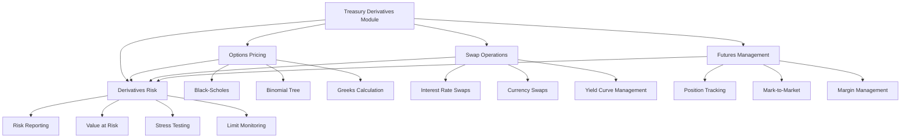
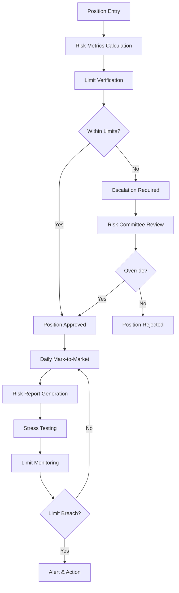

# 📈 Treasury Derivatives Module

  

## 🔍 Overview

The Treasury Derivatives Module provides comprehensive functionality for managing derivative financial instruments within the Core Banking System. The module supports various derivative types including options, swaps, and futures, along with robust risk management capabilities.

## 🏗️ Architecture



## 🧩 Components

### 1. 📊 Options Pricing (`options_pricing.py`)
This module provides tools for pricing and analyzing options.

**Key Features:**
- ✅ Support for various option types (call, put) and styles (European, American)
- ✅ Black-Scholes pricing model implementation
- ✅ Greeks calculation (delta, gamma, theta, vega, rho)
- ✅ Binomial tree model for American option valuation

### 2. 💱 Swap Operations (`swap_operations.py`)
This module handles interest rate and currency swaps management.

**Key Features:**
- ✅ Interest rate swap modeling with fixed and floating legs
- ✅ Currency swap handling
- ✅ Yield curve management and interpolation
- ✅ Swap valuation and pricing
- ✅ Cash flow generation and projection
- ✅ Risk metrics calculation (DV01, duration)

### 3. 📋 Futures Management (`futures_management.py`)
This module provides tools for managing futures contracts and positions.

**Key Features:**
- ✅ Support for different futures types (equity, interest rate, commodity)
- ✅ Position tracking and valuation
- ✅ Mark-to-market calculations
- ✅ Margin call handling and monitoring
- ✅ Expiry and roll management
- ✅ Portfolio aggregation and analysis

### 4. ⚖️ Derivatives Risk Management (`derivatives_risk.py`)
This module provides comprehensive risk management tools for derivative positions.

**Key Features:**
- ✅ Unified position management across instrument types
- ✅ Risk metrics calculation (VaR, Greeks, sensitivities)
- ✅ Risk limit setting and monitoring
- ✅ Stress testing and scenario analysis
- ✅ Portfolio-level risk assessment
- ✅ Risk reporting and visualization

## 📈 Derivatives Instruments

| Instrument Type | Module | Key Features | Risk Metrics |
|-----------------|--------|--------------|-------------|
| **🔄 Options** | options_pricing.py | Valuation, Exercise modeling | Delta, Gamma, Vega, Theta |
| **💹 Swaps** | swap_operations.py | Cash flow projection, Valuation | DV01, Duration, Convexity |
| **📑 Futures** | futures_management.py | Position tracking, Margin management | Beta, VaR, Liquidity risk |
| **🔗 Structured Products** | structured_products.py | Custom payoff modeling | Aggregate risk metrics |

## 💻 Usage Examples

### Options Management

```python
from treasury.derivatives.options_pricing import (
    Option, OptionType, OptionStyle, BlackScholes
)

# Create an option
spy_call = Option(
    id="OPT_SPY_CALL",
    underlying="SPY",
    option_type=OptionType.CALL,
    style=OptionStyle.AMERICAN,
    strike_price=Decimal("450.0"),
    expiry_date=today + datetime.timedelta(days=30),
    contract_size=100,
    currency="USD"
)

# Price the option
result = BlackScholes.price_option(
    option=spy_call,
    spot_price=440.0,
    risk_free_rate=0.045,
    volatility=0.20
)

# Access option price and Greeks
price = result["price"]
delta = result["delta"]
gamma = result["gamma"]
```

### Swap Management

```python
from treasury.derivatives.swap_operations import (
    SwapManager, PaymentFrequency, DayCountConvention
)

# Create a swap manager
swap_manager = SwapManager()

# Update yield curve for pricing
usd_curve = {
    "0.25": 0.0425,  # 3 month
    "0.5": 0.0440,   # 6 month
    "1": 0.0455,     # 1 year
    "2": 0.0465,     # 2 year
    "3": 0.0470,     # 3 year
    "5": 0.0480,     # 5 year
    "7": 0.0485,     # 7 year
    "10": 0.0490     # 10 year
}
swap_manager.update_yield_curve("USD", usd_curve)

# Set reference rates
swap_manager.update_reference_rate("SOFR", 0.0430)

# Create an interest rate swap
swap = swap_manager.create_interest_rate_swap(
    id="SWAP_5Y_USD",
    effective_date=today,
    maturity_date=today.replace(year=today.year + 5),
    fixed_rate=Decimal("0.0465"),  # 4.65%
    floating_rate_index="SOFR",
    notional=Decimal("10000000"),  # 10 million
    currency="USD",
    payment_frequency=PaymentFrequency.QUARTERLY,
    day_count_convention=DayCountConvention.THIRTY_360,
    floating_spread=Decimal("0.0010"),  # 10 basis points
    pay_fixed=True,
    counterparty="Bank XYZ"
)

# Value the swap
swap_value = swap_manager.value_swap("SWAP_5Y_USD")

# Calculate risk metrics
swap_risk = swap_manager.calculate_swap_risk("SWAP_5Y_USD")
```

### Futures Management

```python
from treasury.derivatives.futures_management import (
    FuturesContract, FuturesType, FuturesManager
)

# Create a futures manager
futures_manager = FuturesManager()

# Create a futures contract
tn_future = FuturesContract(
    ticker="ZT",
    contract_month="MAR-24",
    futures_type=FuturesType.INTEREST_RATE,
    exchange="CBOT",
    tick_size=Decimal("0.0078125"),  # 1/128 of a point
    tick_value=Decimal("15.625"),    # Value of one tick
    contract_size=100000,            # $100,000 face value
    currency="USD",
    expiry_date=today.replace(year=today.year + 1, month=3, day=20)
)

futures_manager.add_contract(tn_future)

# Create a futures position
position = futures_manager.create_position(
    contract_code="ZT MAR-24",
    quantity=10,  # Long 10 contracts
    entry_price=Decimal("108.25"),
    initial_margin=Decimal("5000")  # $5,000 initial margin
)

# Update position price (market movement)
futures_manager.update_position_price("ZT MAR-24", Decimal("108.50"))

# Check margin requirements
margin_call = futures_manager.check_margin_requirements("ZT MAR-24")
```

### Derivatives Risk Management

```python
from treasury.derivatives.derivatives_risk import (
    DerivativesRiskManager, RiskMetricType,
    create_option_position_from_option,
    create_swap_position_from_swap,
    create_future_position_from_future
)

# Create a risk manager
risk_manager = DerivativesRiskManager()

# Create derivative positions
option_position = create_option_position_from_option(
    option_id="POS_SPY_CALL",
    option=spy_call,
    quantity=10,  # Long 10 contracts
    spot_price=440.0,
    risk_free_rate=0.045,
    volatility=0.20,
    option_price=12.50,
    counterparty="Broker A"
)

swap_position = create_swap_position_from_swap(
    swap_id="POS_SWAP_5Y_USD",
    swap=swap,
    market_value=swap_value.get("value", 0),
    risk_metrics={
        "dv01": swap_risk["dv01"],
        "duration": swap_risk["duration"],
    }
)

future_position = create_future_position_from_future(
    position_id="POS_ZT_MAR24",
    future_position=position
)

# Add positions to risk manager
risk_manager.add_position(option_position)
risk_manager.add_position(swap_position)
risk_manager.add_position(future_position)

# Set risk limits
risk_manager.set_risk_limit(
    RiskMetricType.VALUE_AT_RISK,
    Decimal("500000"),
    Decimal("0.8"),
    description="Maximum portfolio VaR"
)

# Define stress scenarios
risk_manager.define_stress_scenario(
    "interest_rate_up",
    "Parallel upward shift of interest rate curve by 100 bps",
    {
        "interest_rate": {
            "1Y": 0.01,
            "2Y": 0.01,
            "5Y": 0.01,
            "10Y": 0.01
        }
    }
)

# Run stress test
result = risk_manager.run_stress_test("interest_rate_up")

# Generate risk report
risk_report = risk_manager.generate_risk_report()
report_text = risk_manager.format_risk_report(risk_report)
```

## 🔄 Risk Management Process



## 🔗 Integration with Other Modules

The derivatives module integrates with other treasury components and bank systems:

| System | Integration Type | Purpose |
|--------|------------------|---------|
| **💰 Bond Portfolio Management** | Bi-directional | Hedge interest rate risk in bond portfolios |
| **💧 Liquidity Management** | Input/Output | Adjust duration and cash flow timing |
| **💱 Foreign Exchange** | Bi-directional | Cross-currency risk management |
| **📋 Risk-Compliance** | Output | Regulatory reporting and compliance checks |

For a comprehensive example showing the integration of all treasury components, refer to the `integration_example.py` file in the treasury module.

## 📝 Notes on Implementation

- ✅ All financial calculations are performed using `Decimal` to ensure precision
- ✅ The Black-Scholes implementation includes adjustments for dividends
- ✅ Swap pricing uses the dual-curve approach with OIS discounting
- ✅ Risk calculations include both historical VaR and parametric VaR methods
- ✅ Stress testing framework is designed to be flexible and customizable

## 📊 Performance Metrics


## 🔒 Security Considerations

- 🛡️ Transactions are signed and logged for audit purposes
- 🔐 Position limits are enforced by role-based access control
- 📜 Audit trails are maintained for all risk limit modifications
- 🔍 All pricing model parameters are validated before use

## 📚 Further Documentation

- [Options Pricing Models](../implementation_guides/options_pricing_models.md)
- [Swap Pricing Guide](../implementation_guides/swap_pricing.md)
- [Futures Margin Management](../implementation_guides/futures_margin.md)
- [Risk Management Framework](../implementation_guides/risk_framework.md)

---

<div align="center">
  
  **Last Updated: May 17, 2025**
  
  [](https://github.com/your-username/CBS_PYTHON/graphs/contributors)
  [](https://github.com/your-username/CBS_PYTHON/issues)
  [](https://github.com/your-username/CBS_PYTHON/stargazers)
  
</div>
