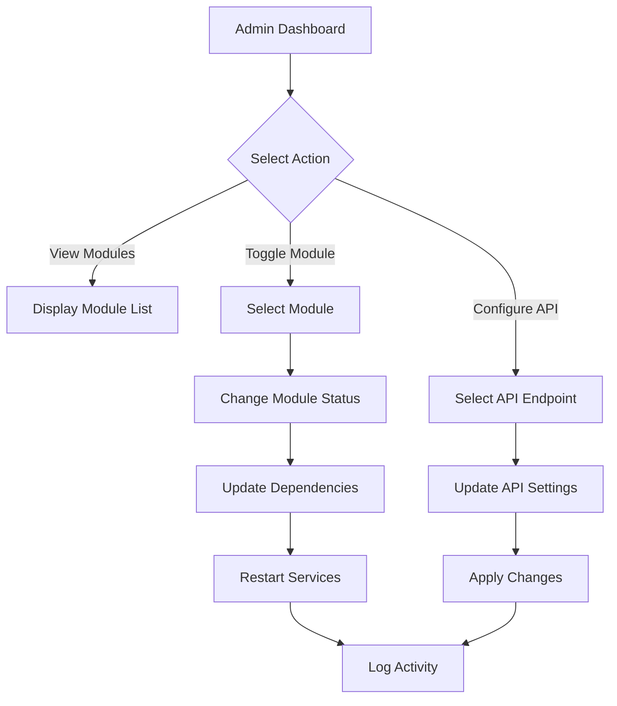

# Core Banking System - Admin Module Implementation Plan

## 🎮 Admin Module Overview

The Admin Module serves as the central command center for the CBS_PYTHON system, enabling administrators to control, configure, and monitor all modules and API-level functions. This module follows the Clean Architecture principles while providing specialized capabilities for system management.

```
┌─────────────────────────────────────────────────────────┐
│                   🎮 Admin Dashboard                    │
│                                                         │
│  ┌─────────────┐  ┌─────────────┐  ┌─────────────────┐  │
│  │ Module      │  │ API         │  │ System          │  │
│  │ Management  │  │ Management  │  │ Configuration   │  │
│  └─────────────┘  └─────────────┘  └─────────────────┘  │
│                                                         │
│  ┌─────────────┐  ┌─────────────┐  ┌─────────────────┐  │
│  │ User        │  │ Audit &     │  │ Performance     │  │
│  │ Management  │  │ Logging     │  │ Monitoring      │  │
│  └─────────────┘  └─────────────┘  └─────────────────┘  │
└─────────────────────────────────────────────────────────┘
```

## 📋 Core Functionalities

| Feature | Description | Priority |
|---------|-------------|----------|
| **Module Management** | Attach/detach modules, toggle module modes, view module status | High |
| **API Endpoints Control** | Enable/disable API endpoints, set rate limits, monitor usage | High |
| **Feature Flags** | Toggle features within modules, A/B testing support | Medium |
| **User Administration** | Manage admin users, roles, and permissions | High |
| **System Configuration** | Centralized configuration management for all modules | Medium |
| **Audit & Logging** | View system activity logs, security audit trails | High |
| **Performance Monitoring** | Monitor system health, resource usage, response times | Medium |
| **Deployment Management** | Manage deployment configurations, environments | Low |

## 🏗️ Clean Architecture Implementation

### Domain Layer

```python
# Core entities
@dataclass
class Module:
    id: str
    name: str
    version: str
    status: ModuleStatus
    dependencies: List[str]
    features: Dict[str, FeatureFlag]

@dataclass
class ApiEndpoint:
    id: str
    path: str
    module_id: str
    method: str  # GET, POST, etc.
    enabled: bool
    rate_limit: Optional[int]  # requests per minute
    auth_required: bool

@dataclass
class FeatureFlag:
    name: str
    description: str
    enabled: bool
    module_id: str
    affects_endpoints: List[str]
```

### Application Layer

```python
# Key interfaces
class ModuleRepository(ABC):
    @abstractmethod
    def get_all_modules(self) -> List[Module]: pass

    @abstractmethod
    def get_module_by_id(self, module_id: str) -> Optional[Module]: pass

    @abstractmethod
    def update_module(self, module: Module) -> Module: pass

class ApiEndpointRepository(ABC):
    @abstractmethod
    def get_endpoints_by_module(self, module_id: str) -> List[ApiEndpoint]: pass

    @abstractmethod
    def update_endpoint(self, endpoint: ApiEndpoint) -> ApiEndpoint: pass
```

## 📊 Module Management Workflow



## 📱 Admin API Endpoints

| Endpoint | Method | Description | Authentication |
|----------|--------|-------------|----------------|
| `/admin/modules` | GET | List all modules and their status | Admin token |
| `/admin/modules/{id}` | GET | Get detailed module information | Admin token |
| `/admin/modules/{id}/toggle` | POST | Enable/disable a module | Admin token |
| `/admin/modules/{id}/configure` | POST | Update module configuration | Admin token |
| `/admin/api/endpoints` | GET | List all API endpoints | Admin token |
| `/admin/api/endpoints/{id}/toggle` | POST | Enable/disable an API endpoint | Admin token |
| `/admin/features` | GET | List all feature flags | Admin token |
| `/admin/features/{id}/toggle` | POST | Toggle a feature flag | Admin token |
| `/admin/system/health` | GET | System health overview | Admin token |
| `/admin/logs` | GET | View system logs | Admin token |

## 🔄 Module Lifecycle Management

| State | Description | Actions Available |
|-------|-------------|-------------------|
| **Installed** | Module files present but not active | Activate, Uninstall |
| **Active** | Module running normally | Deactivate, Configure, Restart |
| **Deactivated** | Module installed but not running | Activate, Uninstall |
| **Maintenance** | Module running with limited functionality | Restore, Deactivate |
| **Failed** | Module attempted to start but failed | Diagnose, Restart, Deactivate |

## 🚀 Implementation Timeline

| Phase | Deliverables | Timeline | Dependencies |
|-------|--------------|----------|--------------|
| **Phase 1** | Core module management, basic API toggles | Week 1-2 | None |
| **Phase 2** | Feature flags, configuration management | Week 3-4 | Phase 1 |
| **Phase 3** | Audit logging, health monitoring | Week 5-6 | Phase 2 |
| **Phase 4** | Advanced deployment management, A/B testing | Week 7-8 | Phase 3 |

## 🔐 Security Considerations

- All admin actions require multi-factor authentication
- Role-based access control for different admin functions
- Complete audit trail of all administrative actions
- Encrypted configuration storage
- Rate limiting on all admin APIs to prevent brute force attacks

## 📈 Performance Impact Management

The admin module includes tools to monitor and manage the performance impact of various system configurations:

| Tool | Purpose | Metrics |
|------|---------|---------|
| **Impact Analyzer** | Predict performance impact before applying changes | CPU, Memory, Response Time |
| **Load Simulator** | Test system under various configurations | Throughput, Error Rate |
| **Degradation Detector** | Auto-detect when changes cause performance issues | Latency, Resource Usage |
| **Rollback Automation** | Auto-rollback harmful changes | System Health Score |

## 🔄 Integration with Other Modules

| Module | Integration Points |
|--------|-------------------|
| **Core Banking** | Account service management, transaction processing configuration |
| **Payments** | Payment gateway settings, daily limits, processing modes |
| **Digital Channels** | Channel availability, feature toggles, maintenance windows |
| **Risk & Compliance** | Rule toggling, threshold configuration, reporting settings |
| **Customer Management** | Service availability, process flow configuration |

---

This admin module implementation plan provides a comprehensive approach to managing all aspects of the CBS_PYTHON system through a centralized, secure interface following Clean Architecture principles. The module enables fine-grained control over system behavior while maintaining separation of concerns and ensuring system stability.
