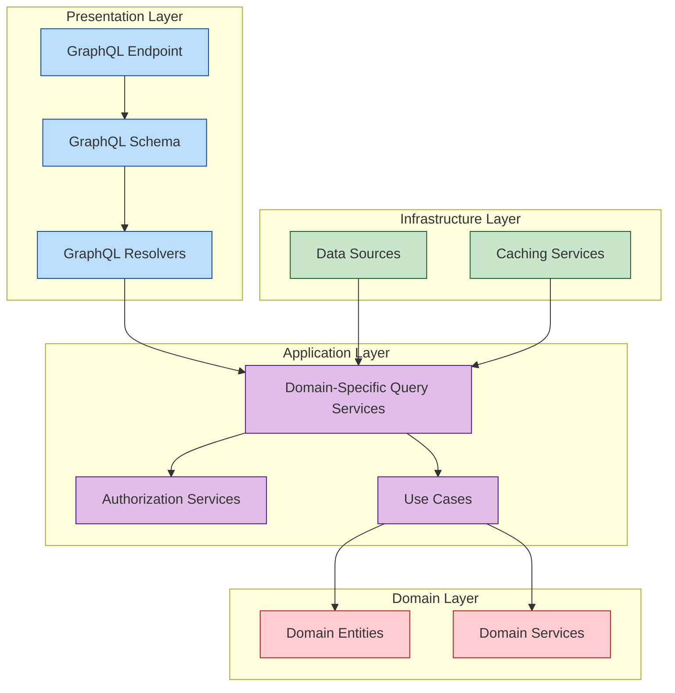

# GraphQL Implementation Roadmap

  

## 📋 Overview

This document outlines the implementation plan for GraphQL support in the API Integration module of the CBS_PYTHON banking system. GraphQL will provide a more flexible and efficient API query interface alongside our existing REST API endpoints.

## 🎯 Objectives

- Implement a GraphQL API layer following Clean Architecture principles
- Provide a single endpoint with comprehensive query capabilities
- Reduce over-fetching and under-fetching of data
- Support complex nested queries across banking domains
- Maintain consistent security and performance standards

## 🏗️ Architecture Design



## 📊 Implementation Phases

### Phase 1: Foundation (2 weeks)

- [ ] Define GraphQL schema design standards
- [ ] Set up GraphQL server infrastructure using Strawberry (Python)
- [ ] Implement core GraphQL scalar types
- [ ] Create base resolver pattern framework
- [ ] Establish error handling patterns
- [ ] Implement authentication middleware

### Phase 2: Core Banking Schema (3 weeks)

- [ ] Define GraphQL types for Account entities
- [ ] Define GraphQL types for Customer entities
- [ ] Define GraphQL types for Transaction entities
- [ ] Implement basic query resolvers
- [ ] Implement data loaders for efficient data fetching
- [ ] Create query complexity analysis tools

### Phase 3: Advanced Features (3 weeks)

- [ ] Implement pagination standards (cursor-based)
- [ ] Add filtering capabilities to all query types
- [ ] Implement sorting options for list queries
- [ ] Create subscription framework for real-time updates
- [ ] Implement directive-based access control
- [ ] Add query depth limitation protections

### Phase 4: Integration & Testing (2 weeks)

- [ ] Connect GraphQL layer to existing use cases
- [ ] Implement comprehensive unit tests
- [ ] Create integration tests for complex queries
- [ ] Performance testing and optimization
- [ ] Security audit and penetration testing
- [ ] Documentation and examples

### Phase 5: Deployment & Monitoring (2 weeks)

- [ ] Implement APM integration for GraphQL operations
- [ ] Create GraphQL-specific logging
- [ ] Set up monitoring dashboards
- [ ] Configure alerting for performance issues
- [ ] Canary deployment process
- [ ] Developer documentation completion

## 🔍 Technical Specifications

### Schema Design Principles

- Use domain-driven naming conventions
- Implement interface types for shared behaviors
- Utilize union types for polymorphic responses
- Apply nullable fields only when semantically appropriate
- Include descriptions for all schema elements

### Example Schema (Core Banking Domain)

```graphql
type Account {
  id: ID!
  accountNumber: String!
  customerId: ID!
  customer: Customer!
  accountType: AccountType!
  balance: Money!
  status: AccountStatus!
  createdAt: DateTime!
  lastActivityAt: DateTime
  transactions(first: Int, after: String): TransactionConnection!
}

type Customer {
  id: ID!
  customerNumber: String!
  firstName: String!
  lastName: String!
  email: String
  phone: String
  kycStatus: KYCStatus!
  accounts: [Account!]!
  address: Address
}

type TransactionConnection {
  edges: [TransactionEdge!]!
  pageInfo: PageInfo!
  totalCount: Int!
}

type TransactionEdge {
  node: Transaction!
  cursor: String!
}

type PageInfo {
  hasNextPage: Boolean!
  hasPreviousPage: Boolean!
  startCursor: String
  endCursor: String
}

enum AccountType {
  SAVINGS
  CURRENT
  LOAN
  TERM_DEPOSIT
}

enum AccountStatus {
  ACTIVE
  DORMANT
  CLOSED
  FROZEN
}

enum KYCStatus {
  PENDING
  VERIFIED
  REJECTED
  EXPIRED
}

scalar Money
scalar DateTime
```

## 🔐 Security Considerations

- Implement depth limiting to prevent recursive query attacks
- Add query complexity analysis to prevent resource exhaustion
- Utilize persisted queries for production clients
- Implement proper authentication and authorization at resolver level
- Apply rate limiting specific to GraphQL operations
- Hide implementation details in error messages

## 🚀 Performance Optimizations

- Implement DataLoader pattern to batch database requests
- Utilize caching for frequently accessed data
- Apply query cost analysis to prevent expensive operations
- Optimize resolver implementations for common query patterns
- Implement query whitelisting for production environments
- Use APM tools to identify bottlenecks

## 📝 Documentation Strategy

- Generate schema documentation with GraphiQL/GraphQL Playground
- Create example queries for common operations
- Document best practices for clients
- Provide mutation examples with expected responses
- Include error handling documentation
- Create tutorials for complex query patterns

## 🧪 Testing Strategy

- Unit tests for all resolvers
- Integration tests for complex queries
- Performance benchmark tests
- Security penetration tests
- Schema validation tests
- Subscription reliability tests

## 📈 Success Metrics

- API response time improvement compared to REST
- Reduction in total API calls for complex operations
- Developer satisfaction with API flexibility
- Client application performance improvement
- Reduced bandwidth usage for mobile applications
- Improved API documentation comprehensiveness

## 👥 Team Allocation

- 2 Backend Developers (GraphQL schema and resolvers)
- 1 Domain Expert (Banking domain modeling)
- 1 Security Specialist (Authentication and authorization)
- 1 DevOps Engineer (Infrastructure and monitoring)
- 1 QA Engineer (Testing and quality assurance)

## ⏱️ Timeline

| Milestone | Start Date | End Date | Dependencies |
|-----------|------------|----------|--------------|
| Phase 1: Foundation | 2025-05-20 | 2025-06-03 | None |
| Phase 2: Core Banking Schema | 2025-06-04 | 2025-06-24 | Phase 1 |
| Phase 3: Advanced Features | 2025-06-25 | 2025-07-15 | Phase 2 |
| Phase 4: Integration & Testing | 2025-07-16 | 2025-07-29 | Phase 3 |
| Phase 5: Deployment & Monitoring | 2025-07-30 | 2025-08-12 | Phase 4 |

## 🔄 Integration with Existing Systems

- GraphQL will complement, not replace, existing REST APIs
- Authentication will use the same OAuth mechanisms
- Authorization policies will be consistent across API types
- Existing monitoring systems will be extended for GraphQL
- Database access patterns will be optimized for GraphQL queries

## 🛣️ Future Roadmap

- **Federation**: Split GraphQL schema across microservices
- **Automatic Persisted Queries**: Improve network performance
- **Real-time Dashboards**: Using GraphQL subscriptions
- **Mobile-Optimized Schemas**: Tailored for mobile client needs
- **Public API Program**: Extended GraphQL API for partners

## 📋 Approval & Sign-off

| Role | Name | Status | Date |
|------|------|--------|------|
| Project Manager | | Pending | |
| Technical Lead | | Pending | |
| Security Officer | | Pending | |
| Product Owner | | Pending | |